Classification Models
================
Gabriele Ghisleni

> # Exercise 1
>
> -   Load the data
> -   Perform basic data exploration
> -   Check the distributions of attributes
> -   Plot a scatterplot matrix between all the independent variables,
>     coloring the data by disease status
> -   Through plotting, try to understand which attributes are most
>     related to the outcome

Let’s start by load our data: In this case is a comma separated value
file having the headers.

``` r
library(pander)
df <- read.csv("disease.txt", header=T)
pander(head(df,2))
```

| C1  | C2  | C3  | C4  | C5  |  C6  |  C7   | C8  | disease |
|:---:|:---:|:---:|:---:|:---:|:----:|:-----:|:---:|:-------:|
|  3  | 83  | 58  | 31  | 18  | 34.3 | 0.336 | 25  |    0    |
|  0  | 94  | 70  | 27  | 115 | 43.5 | 0.347 | 21  |    0    |

More in detail let’s see how our variables are encoded:

``` r
str(df)
```

    ## 'data.frame':    392 obs. of  9 variables:
    ##  $ C1     : int  3 0 0 1 0 0 2 5 2 3 ...
    ##  $ C2     : int  83 94 128 153 95 126 90 121 108 176 ...
    ##  $ C3     : int  58 70 68 82 80 84 80 72 62 86 ...
    ##  $ C4     : int  31 27 19 42 45 29 14 23 32 27 ...
    ##  $ C5     : int  18 115 180 485 92 215 55 112 56 156 ...
    ##  $ C6     : num  34.3 43.5 30.5 40.6 36.5 30.7 24.4 26.2 25.2 33.3 ...
    ##  $ C7     : num  0.336 0.347 1.391 0.687 0.33 ...
    ##  $ C8     : int  25 21 25 23 26 24 24 30 21 52 ...
    ##  $ disease: int  0 0 1 0 0 0 0 0 0 1 ...

Looking at the variable “disease” which is categorical, and the target
of our future analysis, is marked as integer so we specify to R to treat
it as a factor(with the following labels: 0 = “N”, 1 = “Y”)

``` r
library(ggplot2)
df["disease"] <- factor(df$disease, levels = c(0,1), labels=c("N", "Y"))
xx<- data.frame(disease= c("N","Y"), f=c(262,130)) # from count table
ggplot(data=xx, aes(x="", y=f, fill=disease)) +
  geom_bar(stat="identity", width=1, color="black") +
  coord_polar("y", start=0)+
  labs(title="Pie Chart of the target variable 'disease'")+
  xlab("")+
  ylab("")+
  theme(legend.position = "top")+
  geom_text(data=xx, aes(label=f), vjust=-4)+
  scale_fill_brewer(palette="Set2")+
  theme_minimal()
```

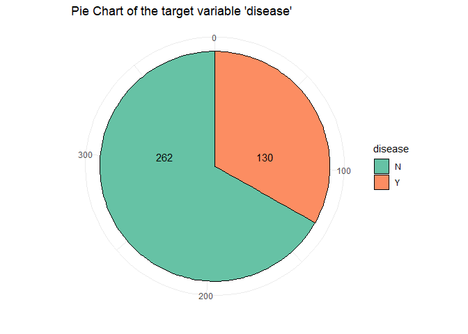<!-- -->

From this piechart we can see that the class is quit unbalanced. An
other basic operation is checkhing the presence of NA’s in the data and
in case handle them:

``` r
for (i in seq(1:length(df))){
  tmp <- sum(is.na(df[,i]))
  print(paste("Number of NA in column", i, "is", tmp))}
```

    ## [1] "Number of NA in column 1 is 0"
    ## [1] "Number of NA in column 2 is 0"
    ## [1] "Number of NA in column 3 is 0"
    ## [1] "Number of NA in column 4 is 0"
    ## [1] "Number of NA in column 5 is 0"
    ## [1] "Number of NA in column 6 is 0"
    ## [1] "Number of NA in column 7 is 0"
    ## [1] "Number of NA in column 8 is 0"
    ## [1] "Number of NA in column 9 is 0"

Na’s are not present. So we can perform a summary on the data frame and
see basic statistics about the variables (as the min, max, quantiles,
mean) on the numeric columns:

``` r
pander(summary(df))
```

|       C1       |      C2       |       C3       |      C4       |
|:--------------:|:-------------:|:--------------:|:-------------:|
|  Min. : 0.000  |  Min. : 56.0  |  Min. : 24.00  |  Min. : 7.00  |
| 1st Qu.: 1.000 | 1st Qu.: 99.0 | 1st Qu.: 62.00 | 1st Qu.:21.00 |
| Median : 2.000 | Median :119.0 | Median : 70.00 | Median :29.00 |
|  Mean : 3.301  |  Mean :122.6  |  Mean : 70.66  |  Mean :29.15  |
| 3rd Qu.: 5.000 | 3rd Qu.:143.0 | 3rd Qu.: 78.00 | 3rd Qu.:37.00 |
|  Max. :17.000  |  Max. :198.0  |  Max. :110.00  |  Max. :63.00  |

Table continues below

|       C5       |      C6       |       C7       |      C8       | disease |
|:--------------:|:-------------:|:--------------:|:-------------:|:-------:|
|  Min. : 14.00  |  Min. :18.20  |  Min. :0.0850  |  Min. :21.00  |  N:262  |
| 1st Qu.: 76.75 | 1st Qu.:28.40 | 1st Qu.:0.2697 | 1st Qu.:23.00 |  Y:130  |
| Median :125.50 | Median :33.20 | Median :0.4495 | Median :27.00 |   NA    |
|  Mean :156.06  |  Mean :33.09  |  Mean :0.5230  |  Mean :30.86  |   NA    |
| 3rd Qu.:190.00 | 3rd Qu.:37.10 | 3rd Qu.:0.6870 | 3rd Qu.:36.00 |   NA    |
|  Max. :846.00  |  Max. :67.10  |  Max. :2.4200  |  Max. :81.00  |   NA    |

We are also interested in other basics statistics as the median and the
standard deviation:

``` r
descriptive_stat_df <- data.frame()
names <- colnames(df)
for (i in 1:8){    # -1 because the last columns if factor
   descriptive_stat_df[i, "Variable"] <- names[i]
   descriptive_stat_df[i, "Mean"] <- mean(df[,i])
   descriptive_stat_df[i, "sd"] <- sd(df[,i])
   descriptive_stat_df[i, "Median"] <- median(df[,i])}
pander(descriptive_stat_df)
```

| Variable | Mean  |   sd   | Median |
|:--------:|:-----:|:------:|:------:|
|    C1    | 3.301 | 3.211  |   2    |
|    C2    | 122.6 | 30.86  |  119   |
|    C3    | 70.66 |  12.5  |   70   |
|    C4    | 29.15 | 10.52  |   29   |
|    C5    | 156.1 | 118.8  | 125.5  |
|    C6    | 33.09 | 7.028  |  33.2  |
|    C7    | 0.523 | 0.3455 | 0.4495 |
|    C8    | 30.86 |  10.2  |   27   |

Let’s also see this statistical features but performing the operation
dividing the data frame into 2 groups, the disease = “Y” and =“N”.

``` r
df_n <- df[df$disease=="N",-9]
df_y <- df[df$disease=="Y",-9]
pander(summary(df_n))
```

|       C1       |      C2       |       C3       |      C4       |
|:--------------:|:-------------:|:--------------:|:-------------:|
|  Min. : 0.000  |  Min. : 56.0  |  Min. : 24.00  |  Min. : 7.00  |
| 1st Qu.: 1.000 | 1st Qu.: 94.0 | 1st Qu.: 60.00 | 1st Qu.:18.25 |
| Median : 2.000 | Median :107.5 | Median : 70.00 | Median :27.00 |
|  Mean : 2.721  |  Mean :111.4  |  Mean : 68.97  |  Mean :27.25  |
| 3rd Qu.: 4.000 | 3rd Qu.:126.0 | 3rd Qu.: 76.00 | 3rd Qu.:34.00 |
|  Max. :13.000  |  Max. :197.0  |  Max. :106.00  |  Max. :60.00  |

Table continues below

|      C5       |      C6       |       C7       |      C8       |
|:-------------:|:-------------:|:--------------:|:-------------:|
|  Min. : 15.0  |  Min. :18.20  |  Min. :0.0850  |  Min. :21.00  |
| 1st Qu.: 66.0 | 1st Qu.:26.12 | 1st Qu.:0.2610 | 1st Qu.:22.00 |
| Median :105.0 | Median :31.25 | Median :0.4135 | Median :25.00 |
|  Mean :130.9  |  Mean :31.75  |  Mean :0.4722  |  Mean :28.35  |
| 3rd Qu.:163.8 | 3rd Qu.:36.10 | 3rd Qu.:0.6242 | 3rd Qu.:30.00 |
|  Max. :744.0  |  Max. :57.30  |  Max. :2.3290  |  Max. :81.00  |

``` r
pander(summary(df_y))
```

|       C1       |      C2       |       C3       |      C4       |
|:--------------:|:-------------:|:--------------:|:-------------:|
|  Min. : 0.000  |  Min. : 78.0  |  Min. : 30.00  |  Min. : 7.00  |
| 1st Qu.: 1.000 | 1st Qu.:124.2 | 1st Qu.: 66.50 | 1st Qu.:26.00 |
| Median : 3.000 | Median :144.5 | Median : 74.00 | Median :33.00 |
|  Mean : 4.469  |  Mean :145.2  |  Mean : 74.08  |  Mean :32.96  |
| 3rd Qu.: 7.000 | 3rd Qu.:171.8 | 3rd Qu.: 82.00 | 3rd Qu.:39.75 |
|  Max. :17.000  |  Max. :198.0  |  Max. :110.00  |  Max. :63.00  |

Table continues below

|      C5       |      C6       |       C7       |      C8       |
|:-------------:|:-------------:|:--------------:|:-------------:|
|  Min. : 14.0  |  Min. :22.90  |  Min. :0.1270  |  Min. :21.00  |
| 1st Qu.:127.5 | 1st Qu.:31.60 | 1st Qu.:0.3297 | 1st Qu.:27.25 |
| Median :169.5 | Median :34.60 | Median :0.5460 | Median :33.00 |
|  Mean :206.8  |  Mean :35.78  |  Mean :0.6256  |  Mean :35.94  |
| 3rd Qu.:239.2 | 3rd Qu.:38.35 | 3rd Qu.:0.7865 | 3rd Qu.:43.00 |
|  Max. :846.0  |  Max. :67.10  |  Max. :2.4200  |  Max. :60.00  |

From this view it seems that all the variables have the median close to
the mean except for the variable C5 and C8 (different between
quantiles). To check if there could be some outliers we use box plots.

``` r
ggplot(df, aes(y = C5, fill=disease))+
  geom_boxplot(show.legend=T)+ 
  theme_bw()+
  theme(legend.position = "top")+
  ggtitle("Boxplot C5 ~ Disease")+
  facet_wrap(~disease)
```

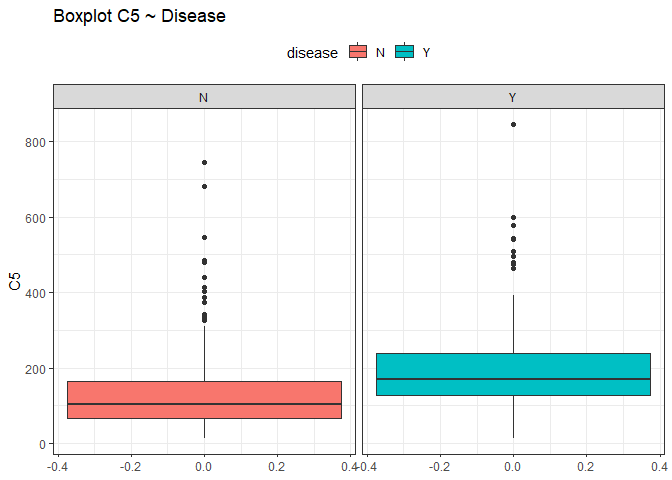<!-- -->

``` r
ggplot(df, aes(y = C8, fill=disease))+
  geom_boxplot(show.legend=T)+ 
  theme_bw()+
  theme(legend.position = "top")+
  ggtitle("Boxplot C8 ~ Disease")+
  facet_wrap(~disease)
```

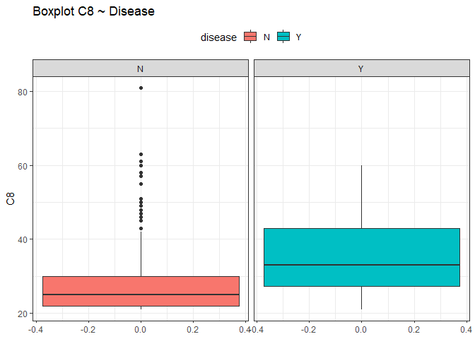<!-- -->

Looking at those box plots we can see that there is the possibility that
some points were outliers. By now we are not sure and we do nothing, we
just keep in mind this situation.

Let’s see the distribution of our variables. Since we will perform the
same operations on all the variables, we will explain step by step only
the first and the others will follow the same reasoning. Since two are
challenges, we left them last.

## Looking at the distributions

The steps are: - Looking at the distribution of the data performing an
histogram or a bar plot. - Try to understand what kind of distribution
is. - Perform the MLE and find the parameters that fit best the
distribution. - Create new arbitrary data with same distribution and
same parameters. - Overlay the new data as a line upon the histogram.

Start with C2: First plot an histogram alone and see what it looks like.

``` r
ggplot(data=df, aes(x = C2, y=..density..))+
  geom_histogram(fill="royalblue", col="black", bins=15, alpha=0.7)+
  ggtitle("C2 Histogram")+
  labs(caption = "Real data")
```

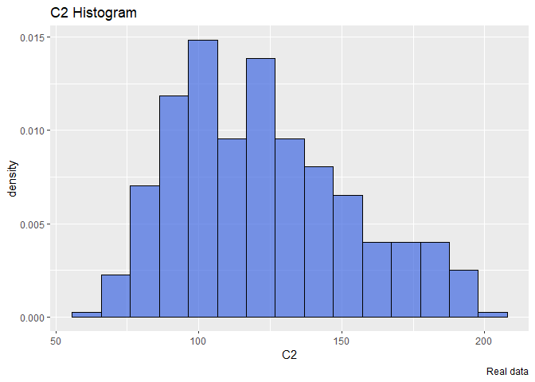<!-- -->

The distribution seems a Gamma. So we will try to find the optimal
parameters that fit a gamma distribution using the maximum likelihood
estimation. To do that we will use the library bbmle and the function
mle2 that requires a function that returns the minus sum of log
likelihood of our data.

``` r
library(bbmle)
llgamma <- function(shape, scale){
  -sum(dgamma(df$C2, shape = shape, scale=scale, log=T)) }
mleG <- mle2(llgamma, start=list(shape=1, scale=1))
summary(mleG)
```

    ## Maximum likelihood estimation
    ## 
    ## Call:
    ## mle2(minuslogl = llgamma, start = list(shape = 1, scale = 1))
    ## 
    ## Coefficients:
    ##       Estimate Std. Error z value     Pr(z)    
    ## shape 16.24150    1.14841  14.143 < 2.2e-16 ***
    ## scale  7.55026    0.54219  13.926 < 2.2e-16 ***
    ## ---
    ## Signif. codes:  0 '***' 0.001 '**' 0.01 '*' 0.05 '.' 0.1 ' ' 1
    ## 
    ## -2 log L: 3773.729

The warnings are not important. The estimation result return a shape
around 16 and a scale around 7.5. Now we create new arbitrary data that
follow a gamma distribution having the same parameters and then we will
overlay this data over our real histogram.

``` r
xx <- seq(40,220, len=300)
yy <- dgamma(xx, shape = mleG@coef[1], scale = mleG@coef[2])
gammaDF <- data.frame(X=xx, Y=yy)
shape <- round(mleG@coef[1],2)
scale <- round(mleG@coef[2],2)
ggplot(data=df, aes(x = C2))+
  geom_histogram(aes(y=..density..), color="black", fill="royalblue", bins=15, alpha=0.7)+
  geom_line(data=gammaDF, aes(x=X, y=Y, colour="Simulated distribution"), lwd=2)+
  scale_color_manual("", values = c("salmon2"))+
  labs(title="C2 Histogram", caption = "The blue histogram represents the actual distribution")+
  labs(subtitle= paste("Simulated distribution ~ Gamma (shape =",shape,",scale =",scale,")"))+
  theme_light()+  theme(legend.position = "top")
```

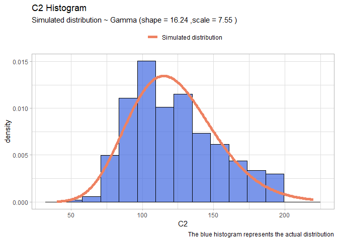<!-- -->

Now that we have illustrated the method we will perform quicker the same
on the remains variables:

-   C3:

``` r
llnorm <- function(mu, sigma){
  -sum(dnorm(df$C3,mu,sigma, log=T))}
mleN <- mle2(llnorm, start=list(mu=60, sigma=20))

xx <- seq(15,120,len=1000)
yy <- dnorm(xx, mleN@coef[1], mleN@coef[2])
Simulated_data <- rep("salmon2", 1000)
normDF <- data.frame(X=xx, Y=yy)

mu <- round(mleN@coef[1],2)
sigma <- round(mleN@coef[2],2)
ggplot(data=df, aes(x = C3))+
  geom_histogram(aes(y=..density..), color="black", fill="royalblue", bins=15, alpha=0.7)+
  geom_line(data=normDF, aes(x=X, y=Y, colour="Simulated distribution"), lwd=2)+
  scale_color_manual("", values = c("salmon2"))+
  labs(title="C3 Histogram", caption = "The blue histogram represents the actual distribution")+
  labs(subtitle= paste("Simulated distribution ~ Norm (mu =",mu,",sigma =",sigma,")"))+
  theme_light()+
  theme(legend.position = "top")
```

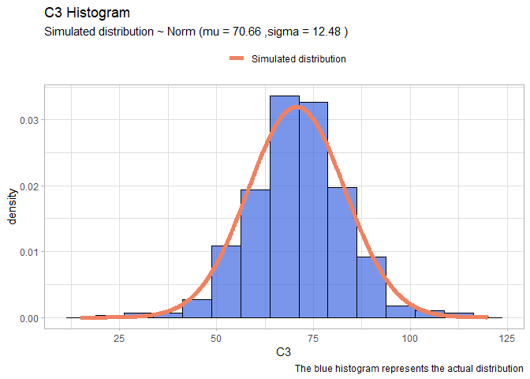<!-- -->

-   C4:

``` r
llnorm <- function(mu, sigma){
  -sum(dnorm(df$C4,mu,sigma, log=T))}
mleN <- mle2(llnorm, start=list(mu=20, sigma=10))

xx <- seq(0,65,len=1000)
yy <- dnorm(xx, mleN@coef[1], mleN@coef[2])
normDF <- data.frame(X=xx, Y=yy)

mu <- round(mleN@coef[1],2)
sigma <- round(mleN@coef[2],2)
ggplot(data=df, aes(x = C4))+
  geom_histogram(aes(y=..density..), color="black", fill="royalblue", bins=15, alpha=0.7)+
  geom_line(data=normDF, aes(x=X, y=Y, colour="Simulated distribution"), lwd=2)+
  scale_color_manual("", values = c("salmon2"))+
  labs(title="C4 Histogram", caption = "The blue histogram represents the actual distribution")+
  labs(subtitle= paste("Simulated distribution ~ Norm (mu =",mu,",sigma =",sigma,")"))+
  theme_light()+
  theme(legend.position = "top")
```

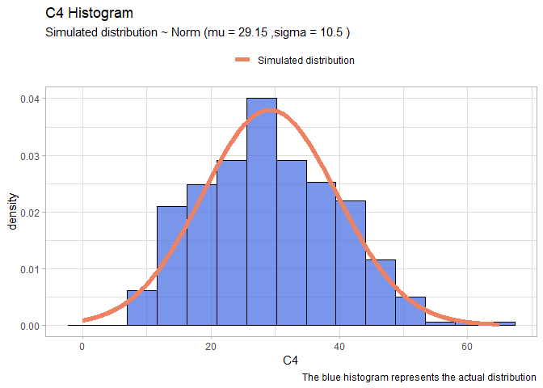<!-- -->

-   C5:

``` r
llgamma <- function(shape, scale){
  -sum(dgamma(df$C5, shape = shape, scale=scale, log=T)) }
mleG <- mle2(llgamma, start=list(shape=1, scale=1))
xx <- seq(1,700)
yy <- dgamma(xx, shape = mleG@coef[1], scale = mleG@coef[2])
gammaDF <- data.frame(X=xx, Y=yy)
shape <- round(mleG@coef[1],2)
scale <- round(mleG@coef[2],2)
ggplot(data=df, aes(x = C5))+
  geom_histogram(aes(y=..density..), color="black", fill="royalblue", bins=20, alpha=0.7)+
  geom_line(data=gammaDF, aes(x=X, y=Y, colour="Simulated distribution"), lwd=2)+
  scale_color_manual("", values = c("salmon2"))+
  labs(title="C5 Histogram", caption = "The blue histogram represents the actual distribution")+
  labs(subtitle= paste("Simulated distribution ~ Gamma (shape =",shape,",scale =",scale,")"))+
  theme_light()+
  theme(legend.position = "top")
```

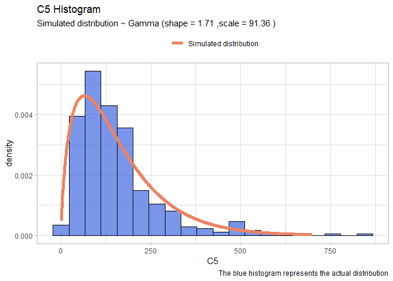<!-- -->

-   C6:

``` r
llnorm <- function(mu, sigma){
  -sum(dnorm(df$C6,mu,sigma, log=T))}
mleN <- mle2(llnorm, start=list(mu=20, sigma=10))

xx <- seq(10,70,len=1000)
yy <- dnorm(xx, mleN@coef[1], mleN@coef[2])
normDF <- data.frame(X=xx, Y=yy)

mu <- round(mleN@coef[1],2)
sigma <- round(mleN@coef[2],2)
ggplot(data=df, aes(x = C6))+
  geom_histogram(aes(y=..density..), color="black", fill="royalblue", bins=50, alpha=0.7)+
  geom_line(data=normDF, aes(x=X, y=Y, colour="Simulated distribution"), lwd=2)+
  scale_color_manual("", values = c("salmon2"))+
  labs(title="C6 Histogram", caption = "The blue histogram represents the actual distribution")+
  labs(subtitle= paste("Simulated distribution ~ Norm (mu =",mu,",sigma =",sigma,")"))+
  theme_light()+
  theme(legend.position = "top")
```

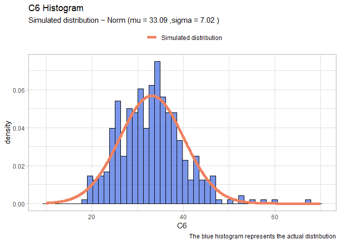<!-- -->

-   C7:

``` r
llgamma <- function(shape, scale){
  -sum(dgamma(df$C7, shape = shape, scale=scale, log=T)) }
mleG <- mle2(llgamma, start=list(shape=1, scale=1))
xx <- seq(0,3,len=100)
yy <- dgamma(xx, shape = mleG@coef[1], scale = mleG@coef[2])
gammaDF <- data.frame(X=xx, Y=yy)
shape <- round(mleG@coef[1],2)
scale <- round(mleG@coef[2],2)
ggplot(data=df, aes(x = C7))+
  geom_histogram(aes(y=..density..), color="black", fill="royalblue", bins=20, alpha=0.7)+
  geom_line(data=gammaDF, aes(x=X, y=Y, colour="Simulated distribution"), lwd=2)+
  scale_color_manual("", values = c("salmon2"))+
  labs(title="C7 Histogram", caption = "The blue histogram represents the actual distribution")+
  labs(subtitle= paste("Simulated distribution ~ Gamma (shape =",shape,",scale =",scale,")"))+
  theme_light()+
  theme(legend.position = "top")
```

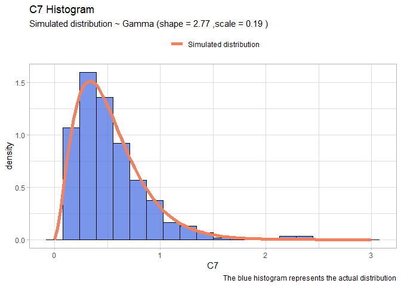<!-- -->

We left the two most problematic variables: C1 and C8. These two have no
clear distribution, we will use the package fitdistrplus to try to
understand properly the distribution:

. C8: Try different distribution and plot over the data.

``` r
library(fitdistrplus)
fit.exp <- fitdist(df$C8, "exp", discrete=T)
fit.lnorm <- fitdist(df$C8, "lnorm", discrete=T)
fit.gamma <- fitdist(df$C8, "gamma", discrete=T)


xx <- seq(18,70,len=1000)
logmean <- round(fit.lnorm$estimate[1],4)
logsd <- round(fit.lnorm$estimate[2],4)
yy <- dlnorm(xx, logmean, logsd)
LnormDF <- data.frame(X=xx, Y=yy)
mu <- round(mleN@coef[1],2)
sigma <- round(mleN@coef[2],2)
lambda<- round(fit.exp$estimate, 2)
ExpDF <- data.frame(X=xx, Y = dexp(xx, lambda))
GammdaDF <- data.frame(X=xx, Y=dgamma(xx, shape=fit.gamma$estimate[1],rate=fit.gamma$estimate[2]))
```

``` r
ggplot(data=df, aes(x = C8))+
  geom_histogram(aes(y=..density..), color="black", fill="royalblue", bins=50, alpha=0.4)+
  geom_line(data=LnormDF, aes(x=X, y=Y, colour="Log-Norm(3.38,0.29)"), lwd=1.3)+
  scale_color_manual("", values = c("forestgreen","salmon","gold"))+
  labs(title="C8 Histogram", caption = "The blue histogram represents the actual distribution")+
  theme_light()+
  theme(legend.position = "top")+
  geom_line(data= ExpDF, aes(x=X, y=Y, colour="Exp(0.3)"),lwd=1.3)+
  geom_line(data= GammdaDF, aes(x=X, y=Y, colour="Gamma(11,0.35)"),lwd=1.3)
```

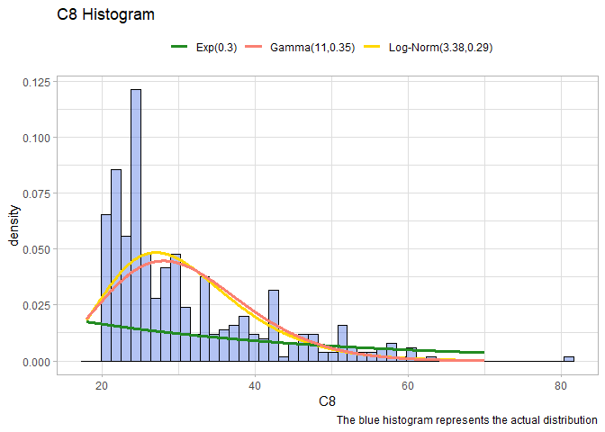<!-- -->

-   C1:

``` r
fit.exp <- fitdist(df$C1, "exp")
xx <- seq(0,15)
yy <- dexp(xx, fit.exp$estimate[1])
expDF <- data.frame(X=xx, Y=yy)

lambda <- round(fit.exp$estimate[1],4)
ggplot(data=df, aes(x = C1))+
  geom_histogram(aes(y=..density..), color="black", fill="royalblue", bins=20, alpha=0.7)+
  geom_line(data=expDF, aes(x=X, y=Y, colour="Simulated distribution"), lwd=2)+
  scale_color_manual("", values = c("salmon2"))+
  labs(title="C1 Histogram", caption = "The blue histogram represents the actual distribution")+
  labs(subtitle= paste("Simulated distribution ~ Exp ( lambda",lambda,")"))+
  theme_light()+
  theme(legend.position = "top")
```

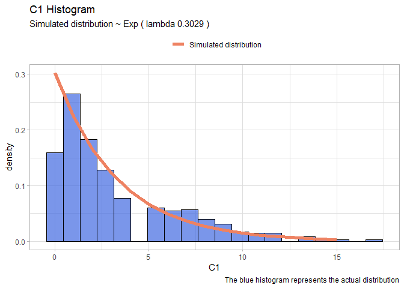<!-- -->

## Scatterplot matrix between all the variables

Let’s move on and plot a scatter plot matrix between all the independent
variables, according to the disease. This is a very huge image, so I
stored and uploaded it on Github. I suggest to open directly the link to
see the results properly.

``` r
library(GGally)
ggpairs(data =df,  aes(color=disease)) + theme_bw()
```

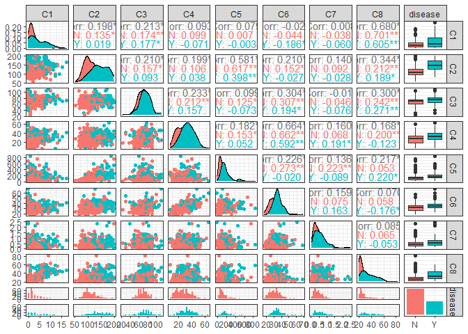<!-- -->

The variables that could be significant are C1, C2, C6,.

> # Exercise 2
>
> Perform a classification of the data into the two classes using a
> logistic regression model on all the predictors. - Evaluate the output
> to identify the most significant predictors. - Evaluate the model
> performance in terms of confusion matrix and train/test accuracy. -
> Using the fitted model, predict the probability of having the disease
> for someone who has C2=31 and all other predictors set to their
> average value.

## Build the training and test sets

Let’s prepare the training and the test sets. We will use around the 80%
of the data in the training set and the others in the test set. to
extract this 80% we will use generated random numbers and will use them
as index.

``` r
set.seed(42)
random_number = sample(392,92)
training_x <- df[-random_number,]
training_y <- df[-random_number,"disease"]
test_x <- df[random_number,]
test_y <- df[random_number, "disease"]
```

## Logistic Regression

The first model that we will use is the Logistic Regression. Since it is
a model that is not based upon euclidean distance or some other type of
distances between points we do not perform the standardization of the
variables.

``` r
logit <- glm(disease~., data= training_x, family=binomial(link = "logit"))
pander(summary(logit))
```

|                 |  Estimate  | Std. Error | z value | Pr(>\|z\|) |
|:---------------:|:----------:|:----------:|:-------:|:----------:|
| **(Intercept)** |   -10.7    |   1.477    | -7.241  | 4.453e-13  |
|     **C1**      |   0.1151   |  0.06671   |  1.725  |  0.08454   |
|     **C2**      |  0.04352   |  0.007019  |  6.201  | 5.604e-10  |
|     **C3**      | -0.002019  |  0.01422   | -0.142  |   0.8871   |
|     **C4**      |  0.01853   |  0.02017   | 0.9183  |   0.3584   |
|     **C5**      | -0.0009058 |  0.001592  | -0.5691 |   0.5693   |
|     **C6**      |  0.08418   |  0.03269   |  2.575  |  0.01002   |
|     **C7**      |   0.4518   |   0.5324   | 0.8485  |   0.3962   |
|     **C8**      |  0.02081   |   0.0219   | 0.9504  |   0.3419   |

(Dispersion parameter for binomial family taken to be 1 )

|                    |                                 |
|:------------------:|:-------------------------------:|
|   Null deviance:   | 380.5 on 299 degrees of freedom |
| Residual deviance: | 246.4 on 291 degrees of freedom |

The variable that is extremely significant is: C2. It has a very low
p-value which represents the possibility to see that data if C2 is not
significant. Also C6 is significant at 1% (usually the threshold is 5%)
and we can consider to use also C1 which has p-value of 8%.

To have a clue if using also C1 we perform the step function which
remove one per time the variable that decrease most the AIC of the model
and stop only when remove another will imply increasing the Akaike
information.

``` r
pander(step(logit, trace=F))
```

|                 | Estimate | Std. Error | z value | Pr(>\|z\|) |
|:---------------:|:--------:|:----------:|:-------:|:----------:|
| **(Intercept)** |  -10.2   |   1.228    | -8.305  |   1e-16    |
|     **C1**      |  0.1594  |  0.04833   |  3.298  | 0.0009733  |
|     **C2**      | 0.04299  |  0.005953  |  7.221  | 5.157e-13  |
|     **C6**      |  0.1008  |  0.02526   |  3.992  | 6.551e-05  |

Fitting generalized (binomial/logit) linear model: disease \~ C1 + C2 +
C6

The function returns us the model including also C1. So we decide to use
this model with C1,C2,C6. We’ve also tried if there are some
interactions between them but the results were negative.

## 3D representation of the data

Since we have only three variables we can plot them and see if we can
find a clear pattern inside the data that can help us to understand
properly how the data are distributed in relation to the dependent
variable that we are trying to understand:

``` r
library(plotly)
fig<- plot_ly(x=df$C1, y=df$C2, z=df$C6, type="scatter3d", mode="markers", color=df$disease,size=3, colors=c("firebrick","royalblue"))
fig <- fig %>% layout(
    title = "Representation 3d of the our predictors colored by the target",
    scene = list(
      xaxis = list(title = "C1"),
      yaxis = list(title = "C2"),
      zaxis = list(title = "C6")))
# since is a pdf here there is the snapshot of the interactive 3d graph:
fig
```

<!-- -->

From this graph we can say straightforwardly that there isn’t a clear
division between the “Y” response and the “N” response. This will make
the work harder.

So let’s perform the logistic regression with C1,C2 and C6:

``` r
logit <- glm(disease~C1+C2+C6, data= training_x, family=binomial(link = "logit"))
pander(summary(logit))
```

|                 | Estimate | Std. Error | z value | Pr(>\|z\|) |
|:---------------:|:--------:|:----------:|:-------:|:----------:|
| **(Intercept)** |  -10.2   |   1.228    | -8.305  |   1e-16    |
|     **C1**      |  0.1594  |  0.04833   |  3.298  | 0.0009733  |
|     **C2**      | 0.04299  |  0.005953  |  7.221  | 5.157e-13  |
|     **C6**      |  0.1008  |  0.02526   |  3.992  | 6.551e-05  |

(Dispersion parameter for binomial family taken to be 1 )

|                    |                                 |
|:------------------:|:-------------------------------:|
|   Null deviance:   | 380.5 on 299 degrees of freedom |
| Residual deviance: | 250.0 on 296 degrees of freedom |

Let’s evaluate the performance of the logistic regression in therms of
confusion matrix score over the test set and the training set. We make a
prediction over our training set and then we label the result having a
cutoff equal to 0.5. After that we will repeat the same operation for
the test set.

## Confusion matrix

``` r
library(broom)
library(cvms)
training_prediction_prob <- predict(logit, training_x,type="response")
training_prediction_labelled <- ifelse(training_prediction_prob>0.5,"Y","N")
cfm <- broom::tidy(table(training_prediction_labelled, training_y))
plot_confusion_matrix(cfm, 
                      target_col = "training_y", 
                      prediction_col = "training_prediction_labelled",
                      counts_col = "n",
                      darkness =1,
                      class_order= c("Y","N"),
                      theme_fn = ggplot2::theme_dark)
```

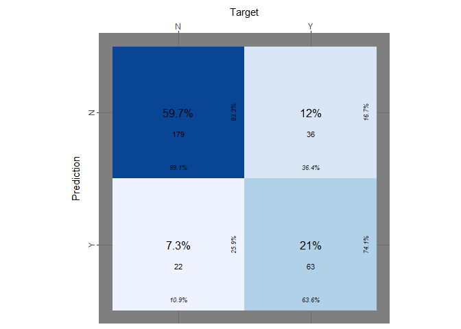<!-- -->

Even if the true positive rate, the true negative rate and others
information are reported on the table we want to explicit those:

``` r
logit_tp <- table(training_prediction_labelled, training_y)[2,2]/ sum(table(training_prediction_labelled, training_y)[,2])
logit_tn <- table(training_prediction_labelled, training_y)[1,1]/sum(table(training_prediction_labelled, training_y)[,1])
logit_accuracy<- mean(training_prediction_labelled==training_y)
print(paste("accuracy logit on training set:",logit_accuracy))
```

    ## [1] "accuracy logit on training set: 0.806666666666667"

``` r
print(paste("true positive rate on training set::", logit_tp))
```

    ## [1] "true positive rate on training set:: 0.636363636363636"

``` r
print(paste("true negative rate on training set::", logit_tn))
```

    ## [1] "true negative rate on training set:: 0.890547263681592"

Now we perform the same operation on the test set:

``` r
test_prediction_prob <- predict(logit, test_x,type="response")
# contrasts(df$disease) # 0:not-disease ; 1: disease
test_prediction_labelled <- ifelse(test_prediction_prob>0.5,"Y","N")
cfm <- broom::tidy(table(test_prediction_labelled, test_y))
plot_confusion_matrix(cfm, target_col="test_y", prediction_col="test_prediction_labelled",
  counts_col="n", darkness=1, class_order=c("Y","N"), theme_fn=ggplot2::theme_dark)
```

<!-- -->

As we did before we explicitly extract the tpr, the fnr and the
accuracy:

``` r
logit_tp_test <- table(test_prediction_labelled, test_y)[2,2]/ sum(table(test_prediction_labelled, test_y)[,2])
logit_tn_test <- table(test_prediction_labelled, test_y)[1,1]/sum(table(test_prediction_labelled, test_y)[,1])
accuracy_logit<- mean(test_prediction_labelled==test_y)
print(paste("accuracy on test_set:",accuracy_logit))
```

    ## [1] "accuracy on test_set: 0.706521739130435"

``` r
print(paste("true positive rate on test_set:", logit_tp_test))
```

    ## [1] "true positive rate on test_set: 0.451612903225806"

``` r
print(paste("true negative rate on test_set:", logit_tn_test))
```

    ## [1] "true negative rate on test_set: 0.836065573770492"

## Predict new observation

From what we can see the model predicts quit well about the negative
case but performs very poorly when the response is “Y”. Moreover we did
not try to predict some cases in which our model has never seen before
similar data as:

``` r
new_obs <- data.frame(C1 = mean(df$C1), C2=31, C6 = mean(df$C6))
# C2=31 none of the training data was similar to this. 
new_obs_prediction <- predict(logit, new_obs, type="response")
print(paste("the probability that the new observation is 'Y' is equl to:", new_obs_prediction ))
```

    ## [1] "the probability that the new observation is 'Y' is equl to: 0.00667738038457288"

> # Exercise 3
>
> Perform a classification via a k-nn model using all of the available
> variables and exploring different values of k; - Discuss the results
> and reach a conclusion on the optimal value for k.

## K-Nearest Neighbor

Let’s use a different model as the k-nearest neighbor and try to predict
better our target variable. Taking in count that k-nn works with
distances we will perform a standardization of our variables.

``` r
library(class)
set.seed(42)
random_number = sample(392,92)

train_x_st <- scale(df[-random_number, -9])
train_y <- df[-random_number,9]

test_x_st <- scale(df[random_number, -9])
test_y <- df[random_number, 9]
```

## Perform the model with multiple K

Knowing that the choice of K is very significant we will perform the
same operation with many different k to see which one has the best trade
off between train and test error rate:

``` r
training_error<- c()
test_error <- c()
for (i in 1:100){
  k1 <- knn(train_x_st, train_x_st, train_y, k=i)
  k2 <- knn(train_x_st,test_x_st, train_y, k=i )
  training_error <- append(training_error,(mean(k1!=train_y)))
  test_error <- append(test_error,(mean(k2!=test_y)))}
```

## Plot the the error rate over K

Let’s plot the training error rate and the test error rate according to
the number of K used to make the prediction in order to be able to
choice the best one.

``` r
error_rate <- data.frame(train_e <- training_error, test_e <- test_error, k<- seq(1:100))
ggplot(data = error_rate, aes(x=k)) +
  geom_line(aes(y = train_e, colour = "Train Error Rate"),lwd=1.2) +
  geom_point(aes(y=train_e), col="salmon2", size=2, shape=19)+
  geom_line(aes(y = test_e, colour = "Test Error Rate"),lwd=1.2) +
  geom_point(aes(y=test_e), col="royalblue3", size=2, shape=19)+
  scale_colour_manual("", 
                      breaks = c("Train Error Rate", "Test Error Rate"),
                      values = c("salmon1","royalblue2")) +
  xlab("Numbers ok K neighbours") + ylab("Train and test error rate")+
  labs(title="Train Error and Test Error ~ K")+
  theme(legend.position="top")
```

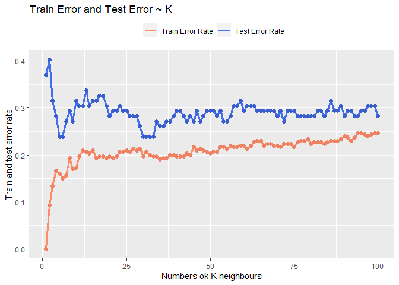<!-- -->

Looking at the result seems that the best trade off could be around 30
or around 6. Looking at the fact that the model after k = 30 seems
converge I will choose 31 as k so to also keep the model quit simple.

``` r
error_rate <- data.frame(train_e <- training_error[1:35], test_e <- test_error[1:35], k<- seq(1:35))
ggplot(data = error_rate, aes(x=k)) +
  geom_line(aes(y = train_e, colour = "Train Error Rate"),lwd=1.2) +
  geom_point(aes(y=train_e), col="salmon2", size=2, shape=19)+
  geom_line(aes(y = test_e, colour = "Test Error Rate"),lwd=1.2) +
  geom_point(aes(y=test_e), col="royalblue3", size=2, shape=19)+
  xlab("Numbers ok K neighbours") +
  ylab("Train and test error rate")+
  labs(title="Train Error and Test Error ~ K")+
  theme(legend.position="top")+
  geom_vline(aes(xintercept=31,colour="K=31"), linetype="dashed", size=1)+
  geom_vline(aes(xintercept=6,colour="K=6"), linetype="dashed", size=1)+
  scale_colour_manual("", 
                      breaks = c("Train Error Rate", "Test Error Rate", "K=31","K=6"),
                      values = c("salmon1","royalblue2","red","gold")) 
```

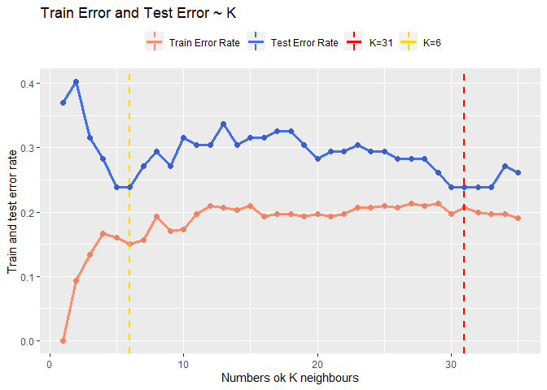<!-- -->

## Confusion matrix

Let’s conclude this part on k-nn plotting the confusion matrix obtained
using k = 31:

``` r
knn_pred <- knn(train_x_st, test_x_st, train_y, k=31, prob = T)
knn_tp <- table(knn_pred, test_y)[2,2]/ sum(table(knn_pred, test_y)[,2])
knn_tn <- table(knn_pred, test_y)[1,1]/sum(table(knn_pred, test_y)[,1])
print(paste("Accuracy with k=31 :",(mean(knn_pred==test_y))))
```

    ## [1] "Accuracy with k=31 : 0.760869565217391"

``` r
print(paste("true positive rate:", knn_tp))
```

    ## [1] "true positive rate: 0.451612903225806"

``` r
print(paste("true negative rate:", knn_tn))
```

    ## [1] "true negative rate: 0.918032786885246"

``` r
knn_pred <- knn(train_x_st, test_x_st, train_y, k=31)
cfm <- broom::tidy(table(knn_pred, test_y))
plot_confusion_matrix(cfm, 
                      target_col = "test_y", 
                      prediction_col = "knn_pred",
                      counts_col = "n",
                      darkness =1,
                      class_order= c("Y","N"),
                      theme_fn = ggplot2::theme_dark)
```

<!-- -->

It seems that our model has problems again to predict the response when
the target is “Y”.

> # Exercise 4

> Explore the use of LDA, QDA, and Naive Bayes to predict disease onset
> using all the predictors. For each method: - Train the model on the
> training data - Apply the fitted model to the test set; compute the
> confusion matrix and prediction accuracy

## LDA

Since it is not a model based upon distances between points we do not
perform the standardization of the variables.

``` r
set.seed(42)
random_number = sample(392,92)
train_x <- df[-random_number,]
train_y <- df[-random_number,9]
test_x <- df[random_number,]
test_y <- df[random_number,9]

LDA <- lda(disease~., data= train_x)
lda_prediction <- predict(LDA, test_x)

lda_tp <- table(lda_prediction$class, test_y)[2,2]/ sum(table(lda_prediction$class, test_y)[,2])
lda_tn <- table(lda_prediction$class, test_y)[1,1]/sum(table(lda_prediction$class, test_y)[,1])
lda_accuracy <- mean(lda_prediction$class==test_y)

print(paste("Accuracy of LDA:", lda_accuracy))
```

    ## [1] "Accuracy of LDA: 0.706521739130435"

``` r
print(paste("true positive rate:", lda_tp))
```

    ## [1] "true positive rate: 0.451612903225806"

``` r
print(paste("true negative rate:", lda_tn))
```

    ## [1] "true negative rate: 0.836065573770492"

``` r
labeled <- lda_prediction$class
cfm <- broom::tidy(table(labeled, test_y))
plot_confusion_matrix(cfm, 
                      target_col = "test_y", 
                      prediction_col = "labeled",
                      counts_col = "n",
                      darkness =1,
                      class_order= c("Y","N"),
                      theme_fn = ggplot2::theme_dark)
```

<!-- -->
As the models before it performs quiet poorly.

## QDA

Since it is not a model based upon distances between points we do not
perform the standardization of the variables.

``` r
set.seed(42)
random_number = sample(392,92)
train_x <- df[-random_number,]
train_y <- df[-random_number,9]
test_x <- df[random_number,]
test_y <- df[random_number,9]

QDA <- qda(disease~., data= train_x)
qda_prediction <- predict(QDA, test_x)

qda_tp <- table(qda_prediction$class, test_y)[2,2]/ sum(table(qda_prediction$class, test_y)[,2])
qda_tn <- table(qda_prediction$class, test_y)[1,1]/sum(table(qda_prediction$class, test_y)[,1])
qda_accuracy <- mean(qda_prediction$class==test_y)

print(paste("Accuracy of QDA:", qda_accuracy))
```

    ## [1] "Accuracy of QDA: 0.717391304347826"

``` r
print(paste("true positive rate:", qda_tp))
```

    ## [1] "true positive rate: 0.451612903225806"

``` r
print(paste("true negative rate:", qda_tn))
```

    ## [1] "true negative rate: 0.852459016393443"

``` r
labeled <- qda_prediction$class
cfm <- broom::tidy(table(labeled, test_y))
plot_confusion_matrix(cfm, 
                      target_col = "test_y", 
                      prediction_col = "labeled",
                      counts_col = "n",
                      darkness =1,
                      class_order= c("Y","N"),
                      theme_fn = ggplot2::theme_dark)
```

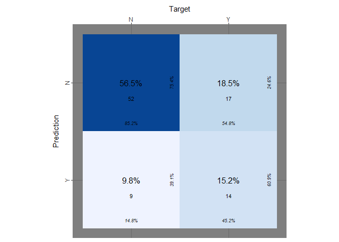<!-- -->

Qda compared to Lda predicts slightly better the negative cases but
returns the same bad result predicting the positive cases.

## Naive Bayes Classifier

Since it is not a model based upon distances between points we do not
perform the standardization of the variables.

``` r
library(e1071)
set.seed(42)
random_number = sample(392,92)
train_x <- df[-random_number,]
train_y <- df[-random_number,9]
test_x <- df[random_number,]
test_y <- df[random_number,9]

NB <- naiveBayes(disease~., data=train_x, )
NB_prediction <- predict(NB, test_x)
NB_prediction_for_ROC <- predict(NB, test_x, type="raw")

nb_tp <- table(NB_prediction, test_y)[2,2]/ sum(table(NB_prediction, test_y)[,2])
nb_tn <- table(NB_prediction, test_y)[1,1]/sum(table(NB_prediction, test_y)[,1])

nb_accuracy <- mean(NB_prediction==test_y)

print(paste("Accuracy of Naive Bayes Classifier:",nb_accuracy ))
```

    ## [1] "Accuracy of Naive Bayes Classifier: 0.739130434782609"

``` r
print(paste("true positive rate:", nb_tp))
```

    ## [1] "true positive rate: 0.548387096774194"

``` r
print(paste("true negative rate:", nb_tn))
```

    ## [1] "true negative rate: 0.836065573770492"

``` r
cfm <- broom::tidy(table(NB_prediction, test_y))
plot_confusion_matrix(cfm, 
                      target_col = "test_y", 
                      prediction_col = "NB_prediction",
                      counts_col = "n",
                      darkness =1,
                      class_order= c("Y","N"),
                      theme_fn = ggplot2::theme_dark)
```

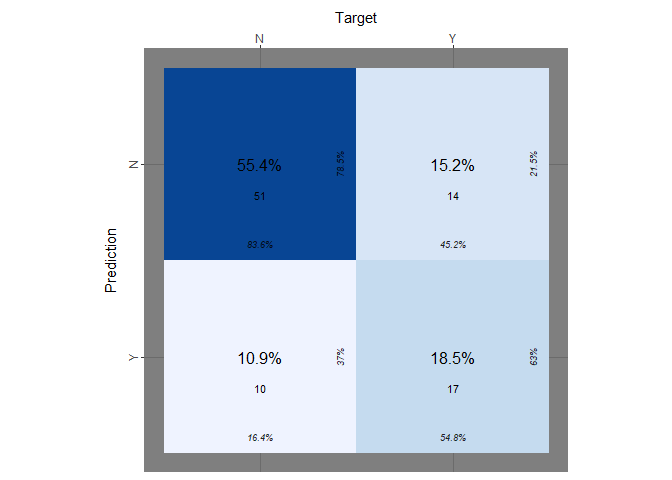<!-- -->

Naive Bayes Classifier seems that performs slightly better. It has a
true positive rate equal to 54.8%, which is again too small.

# Exercise 5

Since all the models perform almost equal, except for the naive bayes
which has a slightly better true positive rate, we will try to change
the cut-off of our prediction and see the results in order to understand
if there is a better mode.

## Comparing the performance of the models

Compare all the methods considered so far on the test data (logistic
regression, k-nn, LDA, QDA, NB). Check again the accuracy of each model
and the true positive and the true negative rate:

``` r
print(paste("accuracy logit:",accuracy_logit))
```

    ## [1] "accuracy logit: 0.706521739130435"

``` r
print(paste("true positive rate:", logit_tp))
```

    ## [1] "true positive rate: 0.636363636363636"

``` r
print(paste("true negative rate:", logit_tn))
```

    ## [1] "true negative rate: 0.890547263681592"

``` r
print(paste("Accuracy with k=31 :",(mean(knn_pred==test_y))))
```

    ## [1] "Accuracy with k=31 : 0.760869565217391"

``` r
print(paste("true positive rate:", knn_tp))
```

    ## [1] "true positive rate: 0.451612903225806"

``` r
print(paste("true negative rate:", knn_tn))
```

    ## [1] "true negative rate: 0.918032786885246"

``` r
print(paste("Accuracy of LDA:", lda_accuracy))
```

    ## [1] "Accuracy of LDA: 0.706521739130435"

``` r
print(paste("true positive rate:", lda_tp))
```

    ## [1] "true positive rate: 0.451612903225806"

``` r
print(paste("true negative rate:", lda_tn))
```

    ## [1] "true negative rate: 0.836065573770492"

``` r
print(paste("Accuracy of QDA:", qda_accuracy))
```

    ## [1] "Accuracy of QDA: 0.717391304347826"

``` r
print(paste("true positive rate:", qda_tp))
```

    ## [1] "true positive rate: 0.451612903225806"

``` r
print(paste("true negative rate:", qda_tn))
```

    ## [1] "true negative rate: 0.852459016393443"

``` r
print(paste("Accuracy of Naive Bayes Classifier:",nb_accuracy ))
```

    ## [1] "Accuracy of Naive Bayes Classifier: 0.739130434782609"

``` r
print(paste("true positive rate:", nb_tp))
```

    ## [1] "true positive rate: 0.548387096774194"

``` r
print(paste("true negative rate:", nb_tn))
```

    ## [1] "true negative rate: 0.836065573770492"

## ROC Curve

Draw the ROC curve, combining all of the ROC curves in a single plot.
Compute also the AUC for each method. Discuss whether there is any
method clearly outperforming the rest:

So the models seems similar between them. Since the class is unbalanced
let’s try to plot the ROC curves of the models and calculate the
respectively AUC.

It tooks a while to understood how the function knn return the
probabilities: basically the probabilities that coming back are the ones
associated to each label assigned. So to transform that I do a loop over
all the array and for each “N” I assign 1-p so all the probabilities
that we have are referred to “Y”.

## Obtaining the probabilities for the knn model

``` r
labe <- knn(train_x_st, test_x_st, train_y, k=31, prob = T)
prob <- attr(labe,which = "prob")
dt <- data.frame(label=labe, p=prob)
dt$reverse <- ifelse(dt$label=="N", 1-dt$p, dt$p)
prob_knn <- dt$reverse
print(mean(ifelse(dt$reverse>0.5,"Y","N")==test_y))
```

    ## [1] 0.7608696

``` r
print(mean(labe==test_y))
```

    ## [1] 0.7608696

## Plot the ROC curve

``` r
library(pROC)
logit_roc <- roc(test_y, test_prediction_prob)
lda_roc <- roc(test_y, lda_prediction$posterior[,2])
qda_roc <- roc(test_y, qda_prediction$posterior[,2])
NBa_roc <- roc(test_y, NB_prediction_for_ROC[,1] )
knn_roc = roc(test_y,prob_knn)
roc_list <- list(LOGIT = logit_roc,
                 LDA = lda_roc,
                 QDA = qda_roc,
                 NB = NBa_roc,
                 KNN=knn_roc)

ggroc(roc_list, lwd=1.2)+
  labs(title="ROC curves of the models")+
  theme(legend.position = "top")+
  labs(colour="") + geom_abline(intercept = 1, slope = 1, lty=2, alpha=0.3)
```

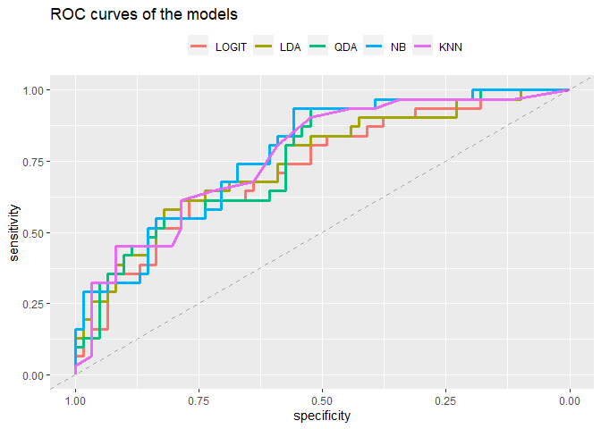<!-- -->

``` r
print(paste("LOGIT AUC:",auc(logit_roc)))
```

    ## [1] "LOGIT AUC: 0.724484399788472"

``` r
print(paste("LDA AUC:",auc(lda_roc)))
```

    ## [1] "LDA AUC: 0.747223691168694"

``` r
print(paste("QDA AUC:",auc(qda_roc)))
```

    ## [1] "QDA AUC: 0.757800105764146"

``` r
print(paste("NB AUC:",auc(NBa_roc)))
```

    ## [1] "NB AUC: 0.777366472765732"

``` r
print(paste("KNN AUC:",auc(knn_roc)))
```

    ## [1] "KNN AUC: 0.768376520359598"

There is no method that clearly overperforms others. We can notice that
the accuracy of the Knn was higher than the NaiveBayes while the area
under the curve smaller so maybe there could be a problem with NB.

> # Exercise 6

> Since the predictors are continuous, there could be also the option of
> including polynomial terms. In the context of logistic regression -
> Consider only the predictor C2 and fit a model which includes higher
> orders of this variable in the model; - Explore different degrees and
> check the performance on test data to reach a conclusion on the
> optimal degree; - Write the formula of your optimal model.

## Polynomial regression

``` r
set.seed(42)
random_number = sample(392,92)
training_x <- df[-random_number,]
training_y <- df[-random_number,"disease"]
test_x <- df[random_number,]
test_y <- df[random_number, "disease"]
accuracy_train <- c()
accuracy_test <- c()
tp_ <- c()
tn_ <- c()

for (i in 1:15){
 poly_logit<- glm(disease~poly(C2,i), data=training_x, family=binomial)
 pred_train <- predict(poly_logit, training_x, type="response") 
 pred_test <- predict(poly_logit, test_x, type="response") 
 lab_train <- ifelse(pred_train>0.5, "Y","N")
 lab_test <- ifelse(pred_test>0.5, "Y","N")
 accuracy_train <- append(accuracy_train, mean(lab_train==training_y))
 accuracy_test <- append(accuracy_test, mean(lab_test==test_y))
 tp <- table(lab_test, test_y)[2,2]/ sum(table(lab_test, test_y)[,2])
 tn <- table(lab_test, test_y)[1,1]/sum(table(lab_test, test_y)[,1])
 tp_ <- append(tp_, tp)
 tn_ <- append(tn_, tn)}
```

## Plot of the results

Let’s plot these results and see what happen trough different degrees of
the polynomial regression:

``` r
degreeDF <- data.frame(ac_train=accuracy_train, ac_test=accuracy_test, tp=tp_, tn=tn_, n=1:length(accuracy_train))
plot1 <-ggplot(data=degreeDF, aes(x=n))+
  geom_line(aes(y=ac_train, colour="Train accuracy"), lwd=1.3)+
  geom_line(aes(y=ac_test, colour="Test accuracy"),lwd=1.3)+
  geom_point(aes(x=n,y=ac_test, colour="Test accuracy"), size=3)+
  geom_point(aes(x=n, y=ac_train, colour="Train accuracy"),size=3)+
  labs(title = "Train and test accuracy ~ Degree of the polynomial")+
  xlab(label="Degree of the polynomial")+
  ylab(label="Train and test accuracy")+
  scale_color_manual("", values=c("royalblue","salmon"))+
  theme(legend.position = "top")

plot2 <- ggplot(data=degreeDF, aes(x=n))+
  geom_line(aes(y=tp, colour="True positive rate"),lwd=1.3)+
  geom_line(aes(y=tn, colour="True negative rate"),lwd=1.3)+
  geom_point(aes(x=n,y=tn, colour="True negative rate"), size=3)+
  geom_point(aes(x=n, y=tp, colour="True positive rate"),size=3)+
  labs(title = "True positive and true negative rate ~ Degree of the polynomial")+
  xlab(label="Degree of the polynomial")+
  ylab(label="True positive and true negative rate")+
  scale_color_manual("", values=c("gold1","firebrick"))+
  theme(legend.position = "top")

gridExtra::grid.arrange(plot1,plot2, ncol=2)
```

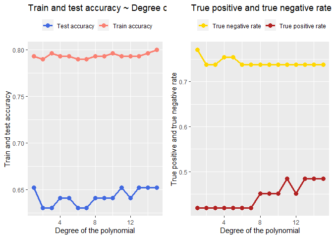<!-- -->

From the two graphs above we can see the true positive rate increase
with the increasing degree of the polynomial but overall it is still
low. After the degree 15? the model performs weird.

``` r
poly_logit<- glm(disease~poly(C2,10), data=training_x, family=binomial)
pander(summary(poly_logit))
```

|                    | Estimate | Std. Error | z value | Pr(>\|z\|) |
|:------------------:|:--------:|:----------:|:-------:|:----------:|
|  **(Intercept)**   |  -9.587  |   16.63    | -0.5766 |   0.5642   |
| **poly(C2, 10)1**  |  315.8   |   563.1    | 0.5609  |   0.5749   |
| **poly(C2, 10)2**  |  -519.6  |    1020    | -0.5096 |   0.6103   |
| **poly(C2, 10)3**  |  752.9   |    1510    | 0.4986  |   0.6181   |
| **poly(C2, 10)4**  |  -792.4  |    1603    | -0.4943 |   0.6211   |
| **poly(C2, 10)5**  |  669.8   |    1399    | 0.4788  |   0.6321   |
| **poly(C2, 10)6**  |  -452.4  |   973.5    | -0.4647 |   0.6421   |
| **poly(C2, 10)7**  |  234.8   |   533.5    | 0.4402  |   0.6598   |
| **poly(C2, 10)8**  |  -99.77  |   248.2    | -0.402  |   0.6876   |
| **poly(C2, 10)9**  |  33.59   |   82.83    | 0.4055  |   0.6851   |
| **poly(C2, 10)10** |  -3.381  |   20.22    | -0.1672 |   0.8672   |

(Dispersion parameter for binomial family taken to be 1 )

|                    |                                 |
|:------------------:|:-------------------------------:|
|   Null deviance:   | 380.5 on 299 degrees of freedom |
| Residual deviance: | 265.8 on 289 degrees of freedom |

if we take the degree of polynomial 10 the formula is:

$$\\hat{p}= \\frac{\\exp(-9.586+ (315.8\*C2)-(519.5\*C2^{2}) + (752.9\*C2^{3}) - (792.3\*C2^{4}) + (669.7\*C2^{5}) -(452\*C2^{6} )...}{1 + \\exp(-9.586+ (315.8\*C2)-(519.5\*C2^{2}) + (752.9\*C2^{3}) - (792.3\*C2^{4}) + (669.7\*C2^{5}) -(452\*C2^{6} )...}$$
We’ve stopped writing but the reasoning is the same up to 10.
