Principal Component and Cluster Analysis
================
Gabriele Ghisleni
19/5/2021

------------------------------------------------------------------------

> ### - Load the data and perform a PCA. Produce a plot of the variance explained by the first components,and a scree plot.

``` r
data <- read.csv("gene_expr.tsv", sep="\t")
```

We start performing the PCA taking care to scale the data, since this
methods is very sensitive to that.

``` r
library("FactoMineR")
library("factoextra")

data_string <- data[,1:2]
data_numeric <- data[,-1:-2]
data_string$subtype <-as.factor(data_string$subtype)
first_PCA <- PCA(data_numeric, scale.unit = TRUE, graph=FALSE)
```

Let’s explore the result of the PCA:

``` r
library(pander)
n = 10
tmp_ <- data.frame(first_PCA$eig[0:n,3])
colnames(tmp_) <- c("Cumulative Variance Explained")
pander(tmp_)
```

|             | Cumulative Variance Explained |
|:-----------:|:-----------------------------:|
| **comp 1**  |             18.11             |
| **comp 2**  |             28.9              |
| **comp 3**  |             34.99             |
| **comp 4**  |             39.56             |
| **comp 5**  |             43.15             |
| **comp 6**  |             46.21             |
| **comp 7**  |             48.78             |
| **comp 8**  |             50.94             |
| **comp 9**  |             52.99             |
| **comp 10** |             54.94             |

We can see that the first ten components explain almost the 55% of the
variance inside our data. We can also graphically see the importance of
those:

``` r
library(ggthemes)
fviz_eig(first_PCA, addlabels=TRUE, ylim=c(0, 100),
         barfill="steelblue", barcolor = "steelblue",
         ncp = n, ggtheme= theme_tufte())
```

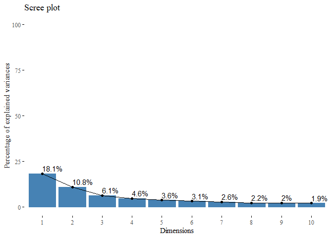<!-- -->

From this plot we can see that there are 2 important components which
contribute with almost 30% of the variance. If we look at the ‘elbow’ in
the screeplot we can capture only the 30%, the rest 70% is distributed
over all the other dimensions.

> ### - Make a few scatterplots of the first principal component score vectors. Plot the observations according to the given subtypes and assess to what extent the subtypes are similar to each other and are captured by the PCA.

``` r
library(ggplot2)
library(gridExtra)
sc <- data.frame(first_PCA$ind$coord)
sc$color = "B" 
sc$color[(nrow(sc)/2):nrow(sc)] <- "T" 

g1 <- ggplot(data=sc, aes(x=Dim.1, y=Dim.2, colour=color))+
      geom_point()+ theme_tufte() + ggtitle("Dim 2 ~ Dim 1")+
      theme(legend.position="top")+ 
      scale_colour_manual("Group", values=c("royalblue","firebrick"))

g2 <- ggplot(data=sc, aes(x=Dim.1, y=Dim.3, colour=color))+
      geom_point()+ theme_tufte() + ggtitle("Dim 3 ~ Dim 1")+
      theme(legend.position="top")+ 
      scale_colour_manual("Group", values=c("royalblue","firebrick"))

g3 <- ggplot(data=sc, aes(x=Dim.2, y=Dim.3, colour=color))+
      geom_point()+ theme_tufte() + ggtitle("Dim 2 ~ Dim 3")+
      theme(legend.position="top")+ 
      scale_colour_manual("Group", values=c("royalblue","firebrick"))

grid.arrange(g1,g2,g3, ncol=3)
```

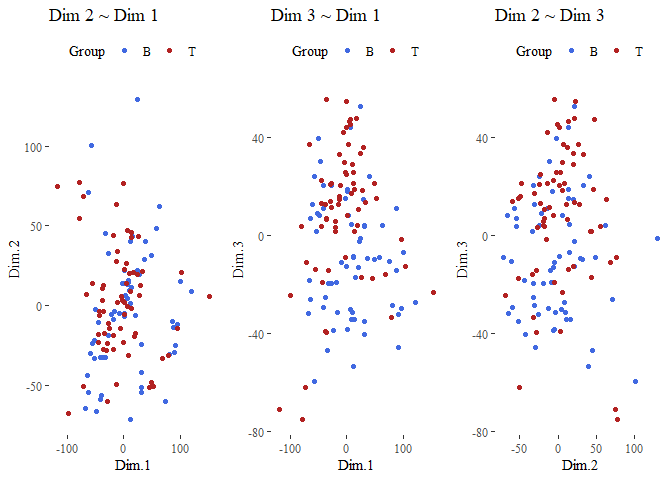<!-- -->

We can see that the points are not very well separated.

> ### - Hierarchically cluster the patients using complete linkage and Euclidean distance as dissimilarity measure. Cut the dendrogram so as to have two groups. Evaluate the goodness of the clustering by comparing the groups with the given subtypes. Provide a numerical similarity measure.

``` r
scale_data = scale(data_numeric)
dist_df <- dist(scale_data) #Euclidean distance is default.
truth <- data_string$subtype
hierarchical_cluster_complete <- hclust(dist_df, method="complete") 
hierarchical_cluster_complete
```

    ## 
    ## Call:
    ## hclust(d = dist_df, method = "complete")
    ## 
    ## Cluster method   : complete 
    ## Distance         : euclidean 
    ## Number of objects: 128

let’s also plot this dendogram:

``` r
fviz_dend(hierarchical_cluster_complete, main="Complete linkage with euclidean distance", 
          k=2, palette= "ucscgb", show_labels=F, ggtheme= ggthemes::theme_tufte())
```

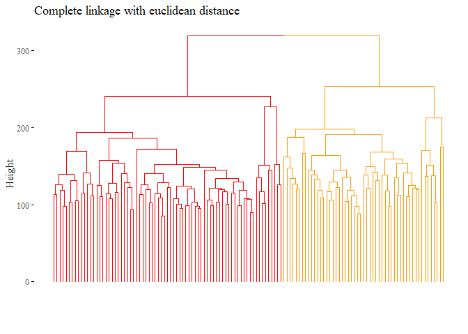<!-- --> We can also have a
numerical representation of the goodness of the model with the ARI.

``` r
library(mclust)

set.seed(42)
cutted <- cutree(hierarchical_cluster_complete, 2)
ARI_hierarchical_cluster_complete <- adjustedRandIndex(truth,cutted)#is correct?
#I was thinking if i use:
#max(ifelse(cutted==1,"B","T"), ifelse(cutted==1,"T","B")) is logical wrong?
print(ARI_hierarchical_cluster_complete)
```

    ## [1] 0.02266644

In this case is very low, so it is not a good cluster analysis. We will
try different linkage or distances then we will try different operation
in order to have better results.

> ### - See if you can improve the results. For example, repeat the procedure using correlation as dissimilarity measure, and with single or average linkage. Discuss the results and pick the combination of dissimilarity measure and linkage method that works best.

We start by all the other method but with the same euclidean distance,
then we will move to the correlation distance, L1 norm and L∞ and we
will also try different linkages!

``` r
h_cluster_eu_average <- hclust((dist_df), method="average")
fviz_dend(h_cluster_eu_average, 
          main="Average linkage with euclidean based distance", 
          k=2, palette= "ucscgb", show_labels=F, ggtheme= ggthemes::theme_tufte())
```

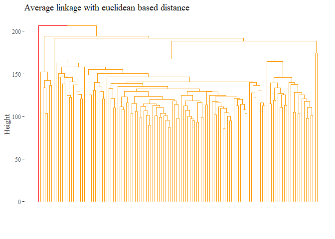<!-- -->

``` r
set.seed(42)
cutted <- cutree(h_cluster_eu_average, 2)
ARI_h_cluster_eu_average <- adjustedRandIndex(truth,cutted)
print(ARI_h_cluster_eu_average)
```

    ## [1] -0.0101038

None of the method based on euclidean distance perform properly, the ARI
is near or under 0. Let’s try with correlation distance instead:

``` r
corr_distance <- as.dist(1 - cor((t(scale_data))))
h_cluster_corr_average <- hclust((corr_distance), method="average")
fviz_dend(h_cluster_corr_average, 
          main="Average linkage with correlation based distance", 
          k=2, palette= "lancet", show_labels=F,  ggtheme= ggthemes::theme_tufte())
```

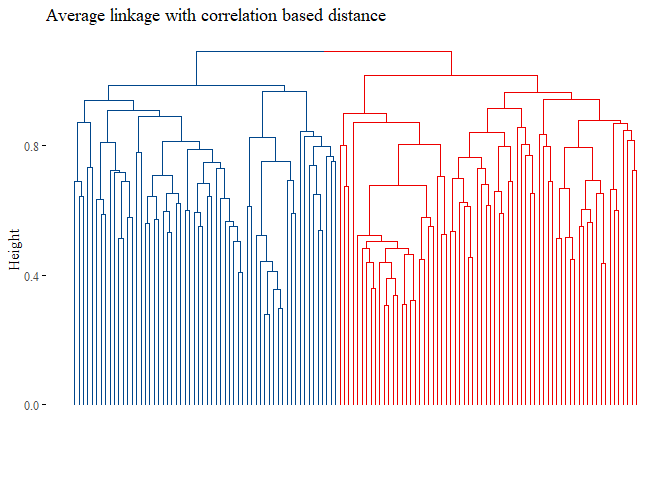<!-- -->

``` r
set.seed(42)
cutted <- cutree(h_cluster_corr_average, 2)
ARI_h_cluster_corr_average <- adjustedRandIndex(truth,cutted)
print(ARI_h_cluster_corr_average)
```

    ## [1] 0.03457948

``` r
h_cluster_corr_complete <- hclust((corr_distance), method="complete")
fviz_dend(h_cluster_corr_complete, 
          main="Complete linkage with correlation based distance", 
          k=2,palette= "lancet", show_labels=F,  ggtheme= ggthemes::theme_tufte())
```

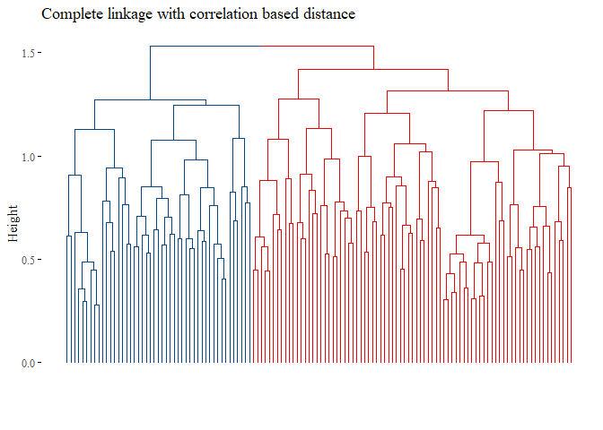<!-- -->

``` r
set.seed(42)
cutted <- cutree(h_cluster_corr_complete, 2)
ARI_h_cluster_corr_complete<- adjustedRandIndex(cutted, truth)
print(ARI_h_cluster_corr_complete)
```

    ## [1] 0.002309898

``` r
h_cluster_corr_single <- hclust((corr_distance), method="single")
fviz_dend(h_cluster_corr_single, 
          main="Single linkage with correlation based distance", 
          k=2, palette= "lancet", show_labels=F, ggtheme= ggthemes::theme_tufte())
```

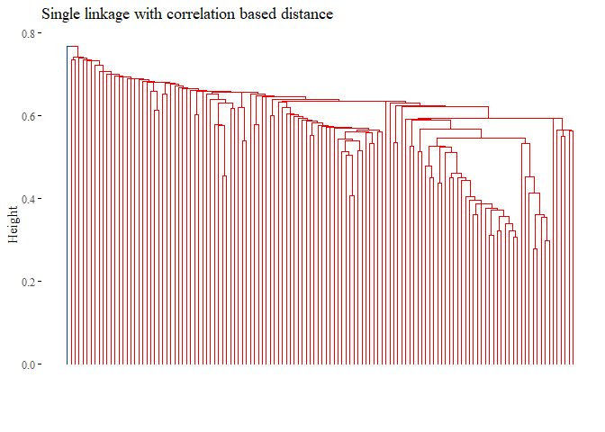<!-- -->

``` r
set.seed(42)
cutted <- cutree(h_cluster_corr_single, 2)
ARI_h_cluster_corr_single <- adjustedRandIndex(truth,cutted)
print(ARI_h_cluster_corr_single)
```

    ## [1] -0.0101038

None of the graph above gave good results. Let’s try with L1 norm
distance:

``` r
library(graphics)
set.seed(42)
l1_dist = dist((scale_data), method="manhattan") # L1_NORM
h_cluster_l1_average <- hclust((l1_dist), method="average")
fviz_dend(h_cluster_l1_average, 
          main="Average linkage with L1 based distance", 
          k=2,palette= "simpsons", show_labels=F, ggtheme= ggthemes::theme_tufte())
```

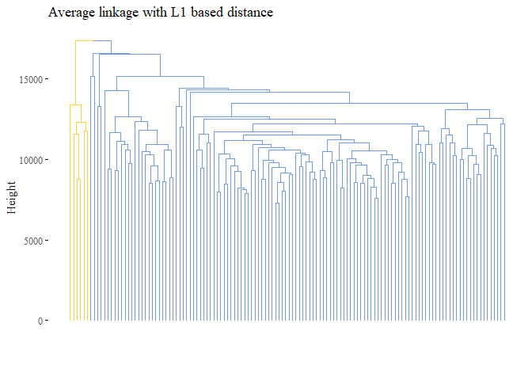<!-- -->

``` r
cutted <- cutree(h_cluster_l1_average, 2)
ARI_h_cluster_l1_average <- adjustedRandIndex(truth,cutted)
print(ARI_h_cluster_l1_average)
```

    ## [1] 0.05067021

``` r
set.seed(42)
h_cluster_l1_complete <- hclust((l1_dist), method="complete")
fviz_dend(h_cluster_l1_complete, 
          main="Complete linkage with L1 based distance", 
          k=2, palette= "simpsons", show_labels=F, ggtheme= ggthemes::theme_tufte())
```

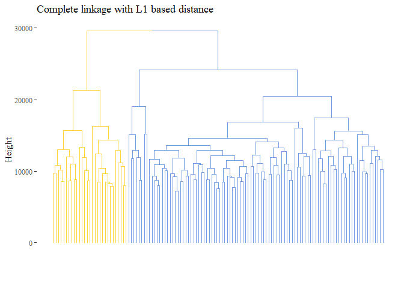<!-- -->

``` r
cutted <- cutree(h_cluster_l1_complete, 2)
ARI_h_cluster_l1_complete <- adjustedRandIndex(truth,cutted)
print(ARI_h_cluster_l1_complete)
```

    ## [1] -0.06349051

``` r
library(graphics)
set.seed(42)
max_dist = dist((scale_data), method="max") # MAX
h_cluster_max_average <- hclust((max_dist), method="average")
fviz_dend(h_cluster_max_average, 
          main="Average linkage with max based distance", 
          k=2,palette= "d3", show_labels=F, ggtheme= ggthemes::theme_tufte())
```

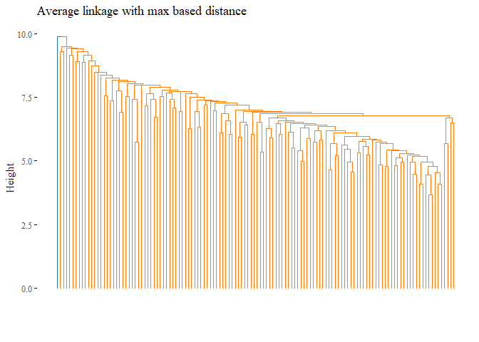<!-- -->

``` r
cutted <- cutree(h_cluster_max_average, 2)
ARI_h_cluster_max_average <- adjustedRandIndex(truth,cutted)
print(ARI_h_cluster_max_average)
```

    ## [1] -0.0101038

``` r
set.seed(42)
h_cluster_max_complete <- hclust((max_dist), method="complete")
fviz_dend(h_cluster_max_complete, 
          main="Complete linkage with max based distance", 
          k=2, palette= "d3", show_labels=F, ggtheme= ggthemes::theme_tufte())
```

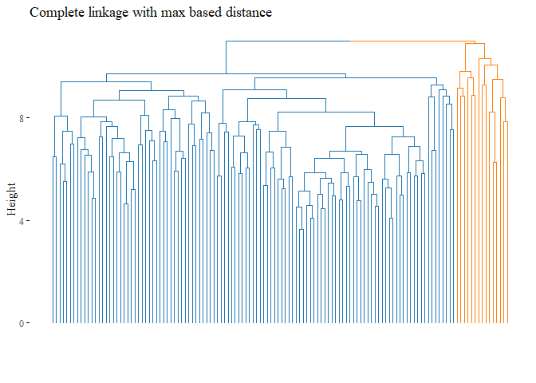<!-- -->

``` r
cutted <- cutree(h_cluster_max_complete, 2)
ARI_h_cluster_max_complete <- adjustedRandIndex(truth,cutted)
print(ARI_h_cluster_max_complete)
```

    ## [1] 0.1278833

``` r
results_first <- data.frame(Value=c(ARI_h_cluster_eu_average,
                                    ARI_h_cluster_corr_single,
                                    ARI_h_cluster_corr_average,
                                   ARI_hierarchical_cluster_complete,
                                   ARI_h_cluster_corr_complete,
                                   ARI_h_cluster_l1_complete,
                                   ARI_h_cluster_l1_average,
                                   ARI_h_cluster_max_average,
                                   ARI_h_cluster_max_complete),
                            Names= c("Average Euclidean","Single correlation", 
                                     "Average correlation", "Complete Euclidean",
                                     "Complete correlation",
                                     "Complete L1",
                                     "Average L1",
                                     "Average Max",
                                     "Complete Max"))

ggplot(data=results_first, aes(y=reorder(Names, +Value), x=Value, fill=Names))+
  geom_bar(stat="identity")+ggtitle("Ari ~ Methods")+
  theme_tufte()+theme(legend.position = "none")+ylab("Method")
```

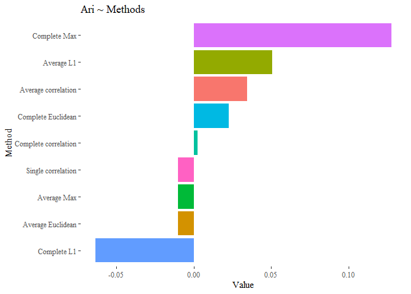<!-- -->

From this first results we can see that none of our cluster analysis is
performing well.

> ### From the full dataset select the top N (e.g., N = 200) genes that differ the most across all samples, based on PCA; repeat the hierarchical clustering; cut the dendrogram to have two groups; evaluate the results.

``` r
total_genes <- prcomp(data_numeric,scale=T)
loadings <- apply(total_genes$rotation, 1, sum)
index <- order(abs(loadings), decreasing=T)
reduced_df <- data_numeric[,index[0:200]]
pander(reduced_df[0:3,0:5]) # first 5 columns
```

| X35644_at | X40428_i\_at | X38671_at | X36432_at | X1586_at |
|:---------:|:------------:|:---------:|:---------:|:--------:|
|   3.163   |    5.264     |   8.896   |   3.873   |  4.514   |
|   3.105   |    5.603     |   7.361   |   3.967   |  4.355   |
|   3.174   |     6.63     |   10.12   |   3.326   |  4.331   |

``` r
scale_data = scale(reduced_df)
dist_df <- dist(scale_data) 
corr_distance <- as.dist(1 - cor(t(scale_data)))

hierarchical_cluster_complete_reduced <- hclust(dist_df, method="complete") 
hierarchical_cluster_complete_reduced
```

    ## 
    ## Call:
    ## hclust(d = dist_df, method = "complete")
    ## 
    ## Cluster method   : complete 
    ## Distance         : euclidean 
    ## Number of objects: 128

let’s also plot this dendogram:

``` r
fviz_dend(hierarchical_cluster_complete_reduced, 
          main="Complete linkage with euclidean distance", 
          k=2,palette= "ucscgb", show_labels=F, ggtheme= ggthemes::theme_tufte())
```

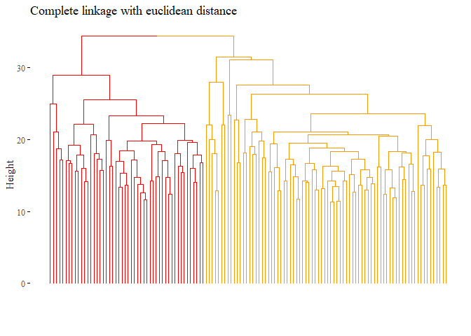<!-- -->

``` r
set.seed(42)
cutted <- cutree(hierarchical_cluster_complete_reduced, 2)
ARI_h_complete_reduced <- adjustedRandIndex(truth,cutted)
ARI_h_complete_reduced
```

    ## [1] 0.02471391

``` r
hierarchical_cluster_average_eu_reduced <- hclust(dist_df, method="average") 
fviz_dend(hierarchical_cluster_average_eu_reduced, 
          main="Average linkage with euclidean distance", 
          k=2,palette= "ucscgb", show_labels=F, ggtheme= ggthemes::theme_tufte())
```

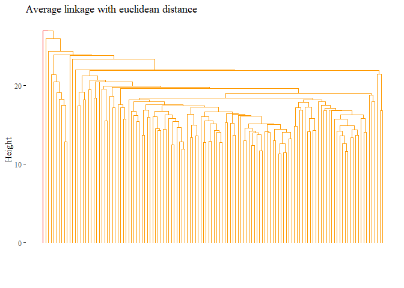<!-- -->

``` r
set.seed(42)
cutted <- cutree(hierarchical_cluster_average_eu_reduced, 2)
ARI_h_avg_reduced <- adjustedRandIndex(truth,cutted)
ARI_h_avg_reduced
```

    ## [1] -0.0101038

``` r
h_cluster_corr_complete_reduced <- hclust((corr_distance), method="complete")
fviz_dend(h_cluster_corr_complete_reduced, 
          main="Complete linkage with correlation based distance", 
          k=2, palette= "lancet", show_labels=F,  ggtheme= ggthemes::theme_tufte())
```

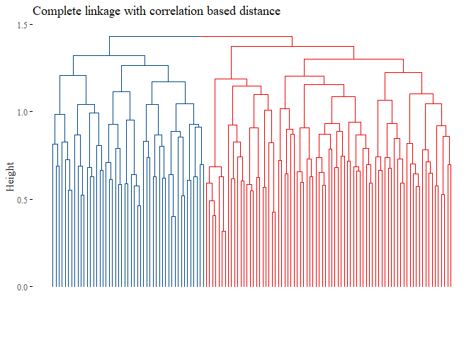<!-- -->

``` r
set.seed(42)
cutted <- cutree(h_cluster_corr_complete_reduced, 2)
ARI_h_corr_complete_reduced <- adjustedRandIndex(truth,cutted)
ARI_h_corr_complete_reduced
```

    ## [1] 0.005940882

``` r
h_cluster_corr_average_reduced <- hclust((corr_distance), method="average")
h_cluster_corr_average_reduced$labels <- data_string$subtype
fviz_dend(h_cluster_corr_average_reduced, 
          main="Average linkage with correlation based distance", 
          k=2, palette= "lancet", show_labels=F,  ggtheme= ggthemes::theme_tufte())
```

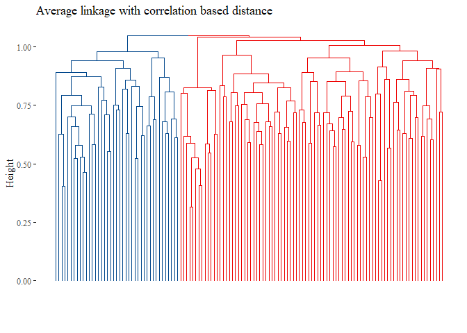<!-- -->

``` r
set.seed(42)
truth <- data_string$subtype
cutted <- cutree(h_cluster_corr_average_reduced, 2)
ARI_h_average_reduced <- adjustedRandIndex(truth,cutted)
ARI_h_average_reduced
```

    ## [1] -0.03280954

``` r
set.seed(42)
l1_dist = dist((scale_data), method="manhattan") 
h_cluster_l1_average <- hclust((l1_dist), method="average")
fviz_dend(h_cluster_l1_average, 
          main="Average linkage with L1 based distance", 
          k=2,palette= "simpsons", show_labels=F, ggtheme= ggthemes::theme_tufte())
```

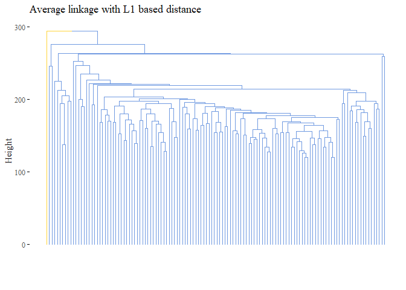<!-- -->

``` r
cutted <- cutree(h_cluster_l1_average, 2)
ARI_h_cluster_l1_average_2 <- adjustedRandIndex(truth,cutted)
print(ARI_h_cluster_l1_average_2)
```

    ## [1] -0.0101038

``` r
set.seed(42)
h_cluster_l1_complete <- hclust((l1_dist), method="complete")
fviz_dend(h_cluster_l1_complete, 
          main="Complete linkage with L1 based distance", 
          k=2, palette= "simpsons", show_labels=F, ggtheme= ggthemes::theme_tufte())
```

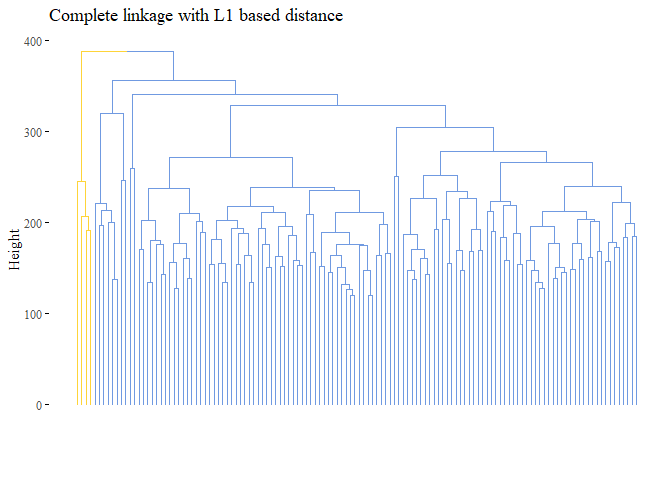<!-- -->

``` r
cutted <- cutree(h_cluster_l1_complete, 2)
ARI_h_cluster_l1_complete_2 <- adjustedRandIndex(truth,cutted)
print(ARI_h_cluster_l1_complete_2)
```

    ## [1] -0.03651606

``` r
library(graphics)
set.seed(42)
max_dist = dist((scale_data), method="max") # MAX
h_cluster_max_average <- hclust((max_dist), method="average")
fviz_dend(h_cluster_max_average, 
          main="Average linkage with max based distance", 
          k=2,palette= "d3", show_labels=F, ggtheme= ggthemes::theme_tufte())
```

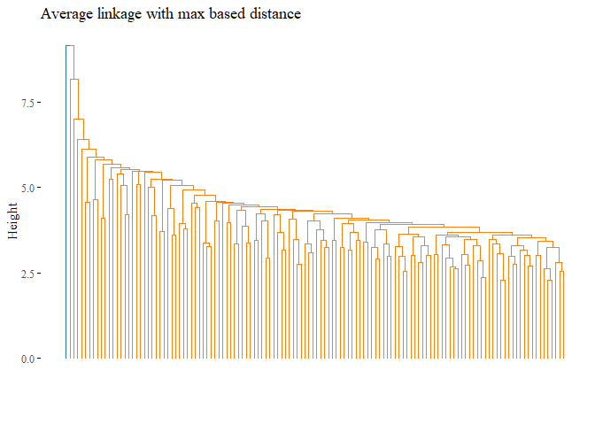<!-- -->

``` r
cutted <- cutree(h_cluster_max_average, 2)
ARI_h_cluster_max_average_2 <- adjustedRandIndex(truth,cutted)
print(ARI_h_cluster_max_average_2)
```

    ## [1] -0.0101038

``` r
set.seed(42)
h_cluster_max_complete <- hclust((max_dist), method="complete")
fviz_dend(h_cluster_max_complete, 
          main="Complete linkage with max based distance", 
          k=2, palette= "d3", show_labels=F, ggtheme= ggthemes::theme_tufte())
```

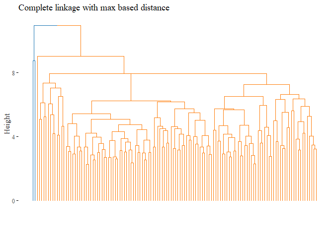<!-- -->

``` r
cutted <- cutree(h_cluster_max_complete, 2)
ARI_h_cluster_max_complete_2 <- adjustedRandIndex(truth,cutted)
print(ARI_h_cluster_max_complete_2)
```

    ## [1] -0.0195435

``` r
results_second <- data.frame(Value=c(ARI_h_avg_reduced,
                                     ARI_h_complete_reduced
                                    ,ARI_h_cluster_corr_complete,
                                    ARI_h_corr_complete_reduced,
                                    ARI_h_cluster_l1_average_2,
                                    ARI_h_cluster_l1_complete_2,
                                    ARI_h_cluster_max_average_2,
                                    ARI_h_cluster_max_complete_2),
                            Names= c("Average euclidean_2", 
                                     "Complete euclidean_2",
                                     "Average correlation_2",
                                     "Complete correlation_2",
                                     "Complete L1_2",
                                     "Average L1_2",
                                     "Average Max_2",
                                     "Complete Max_2"))

ggplot(data=results_second, aes(y=reorder(Names, +Value), x=Value, fill=Names))+
  geom_bar(stat="identity")+ggtitle("Ari ~ Methods")+
  theme_tufte()+theme(legend.position = "none")+ylab("Method")
```

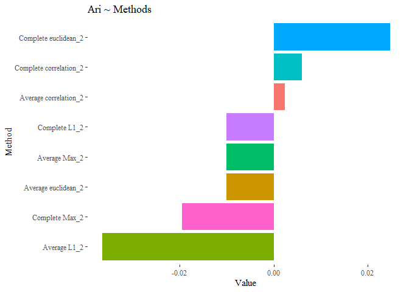<!-- -->

The results are not improved yet. let’s try with this last selection!

> ### A different approach that is popular in gene expression analysis is to keep only the most variable genes for downstream analysis. Since most of the 10K genes have low expression or do not vary much across the experiments, this step usually minimizes the contribution of noise. An unsupervised technique would then aim to identify what explains this variance. Start again from the full dataset and keep only genes whose standard deviation is among the top 5%; perform PCA and produce a scatterplot of the first two principal components scores, coloring observations by subtype; repeat the clustering/ cutting/ evaluation procedure. What do you observe and what conclusions do you make?

``` r
vector <- c()
for (i in 1:length(data_numeric)){
   vector[i] <- sd(data_numeric[,i])}

vector_df <- data.frame(gene_sd=vector, col_id= seq(1:length(vector)))
vector_df <- vector_df[order(vector_df$gene_sd,decreasing=T),]
columns_reduced_id <- vector_df[0:(nrow(vector_df)*5/100),2]
top_var_df <-data_numeric[,columns_reduced_id]
top_var_label <-data_numeric[2,columns_reduced_id]
second_PCA <- PCA(top_var_df, scale.unit = TRUE, graph=FALSE)
fviz_eig(second_PCA, addlabels=TRUE, ylim=c(0, 100),
         barfill="steelblue", barcolor = "steelblue",
         ncp = n, ggtheme= theme_tufte())
```

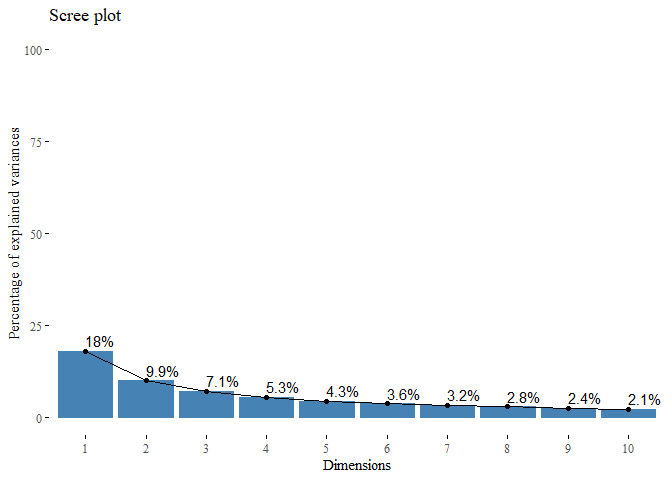<!-- -->

``` r
sc <- data.frame(second_PCA$ind$coord)
sc$color = "B"
sc$color[(nrow(sc)/2):nrow(sc)] <- "T" 

g1 <- ggplot(data=sc, aes(x=Dim.1, y=Dim.2, colour=color))+
      geom_point()+ theme_tufte() + ggtitle("Dim 2 ~ Dim 1")+
      theme(legend.position="top")+ 
      scale_colour_manual("Group", values=c("royalblue","firebrick"))

g2 <- ggplot(data=sc, aes(x=Dim.1, y=Dim.3, colour=color))+
      geom_point()+ theme_tufte() + ggtitle("Dim 3 ~ Dim 1")+
      theme(legend.position="top")+ 
      scale_colour_manual("Group", values=c("royalblue","firebrick"))

g3 <- ggplot(data=sc, aes(x=Dim.2, y=Dim.3, colour=color))+
      geom_point()+ theme_tufte() + ggtitle("Dim 2 ~ Dim 3")+
      theme(legend.position="top")+ 
      scale_colour_manual("Group", values=c("royalblue","firebrick"))

grid.arrange(g1,g2,g3, ncol=3)
```

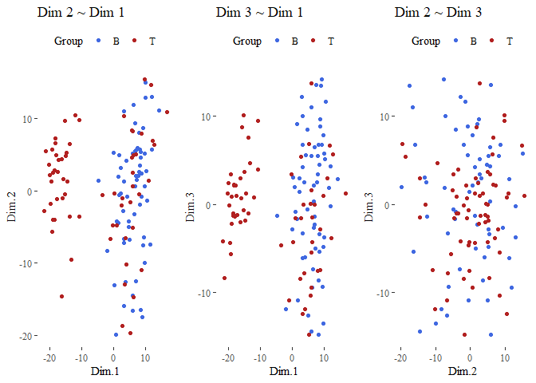<!-- -->

From here we can see that this operation improved the results, the
dimension seems better divided!

``` r
scale_data = scale(top_var_df)
corr_distance <- as.dist(1 - cor(t(as.matrix(scale_data))) )
dist_df <- dist(scale_data) 

hierarchical_cluster_complete_reduced_3 <- hclust(dist_df, method="complete") 
hierarchical_cluster_complete_reduced_3
```

    ## 
    ## Call:
    ## hclust(d = dist_df, method = "complete")
    ## 
    ## Cluster method   : complete 
    ## Distance         : euclidean 
    ## Number of objects: 128

let’s also plot this dendogram:

``` r
fviz_dend(hierarchical_cluster_complete_reduced, 
          main="Complete linkage with euclidean distance", 
          k=2,palette= "ucscgb", show_labels=F, ggtheme= ggthemes::theme_tufte())
```

<!-- -->

``` r
set.seed(42)
cutted <- cutree(hierarchical_cluster_complete_reduced_3, 2)
ARI_h_complete_reduced_3 <- adjustedRandIndex(truth,cutted)
ARI_h_complete_reduced_3
```

    ## [1] 1

``` r
hierarchical_cluster_average_eu_reduced_3 <- hclust(dist_df, method="average") 
fviz_dend(hierarchical_cluster_average_eu_reduced_3, 
          main="Average linkage with euclidean distance", 
          k=2,palette= "ucscgb", show_labels=F, ggtheme= ggthemes::theme_tufte())
```

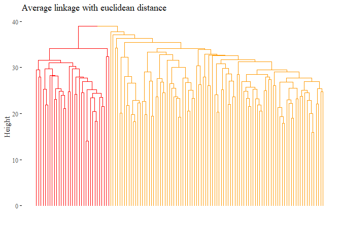<!-- -->

``` r
set.seed(42)
cutted <- cutree(hierarchical_cluster_average_eu_reduced_3, 2)
ARI_h_avg_reduced_3 <- adjustedRandIndex(truth,cutted)
ARI_h_avg_reduced_3
```

    ## [1] 1

``` r
h_cluster_corr_complete_reduced_3 <- hclust((corr_distance), method="complete")
fviz_dend(h_cluster_corr_complete_reduced_3, 
          main="Complete linkage with correlation based distance", 
          k=2, palette= "lancet", show_labels=F,  ggtheme= ggthemes::theme_tufte())
```

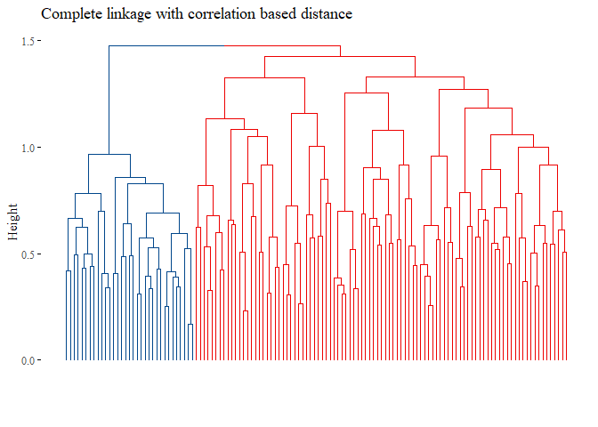<!-- -->

``` r
set.seed(42)
cutted <- cutree(h_cluster_corr_complete_reduced_3, 2)
ARI_h_corr_complete_reduced_3 <- adjustedRandIndex(truth,cutted)
ARI_h_corr_complete_reduced_3
```

    ## [1] 1

``` r
h_cluster_corr_average_reduced_3 <- hclust((corr_distance), method="average")
fviz_dend(h_cluster_corr_average_reduced_3, 
          main="Average linkage with correlation based distance", 
          k=2, palette= "lancet", show_labels=F,  ggtheme= ggthemes::theme_tufte())
```

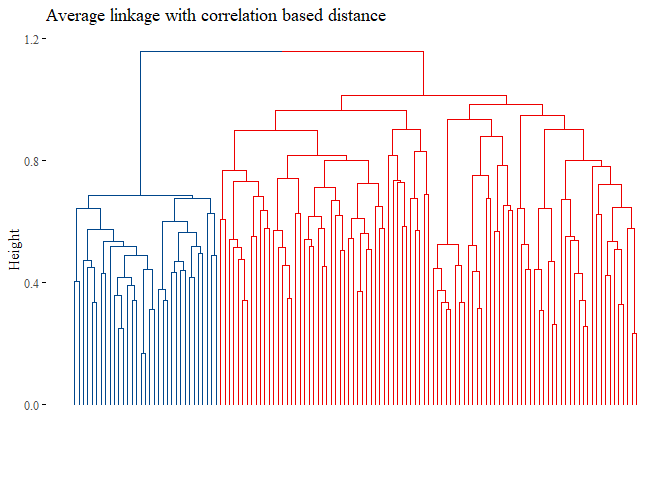<!-- -->

``` r
set.seed(42)
cutted <- cutree(h_cluster_corr_average_reduced_3, 2)
ARI_h_average_reduced_3 <- adjustedRandIndex(truth,cutted)
ARI_h_average_reduced_3
```

    ## [1] 1

``` r
set.seed(42)
l1_dist = dist((scale_data), method="manhattan") 
h_cluster_l1_average <- hclust((l1_dist), method="average")
fviz_dend(h_cluster_l1_average, 
          main="Average linkage with L1 based distance", 
          k=2,palette= "simpsons", show_labels=F, ggtheme= ggthemes::theme_tufte())
```

<!-- -->

``` r
cutted <- cutree(h_cluster_l1_average, 2)
ARI_h_cluster_l1_average_3 <- adjustedRandIndex(truth,cutted)
print(ARI_h_cluster_l1_average_3)
```

    ## [1] 1

``` r
set.seed(42)
h_cluster_l1_complete <- hclust((l1_dist), method="complete")
fviz_dend(h_cluster_l1_complete, 
          main="Complete linkage with L1 based distance", 
          k=2, palette= "simpsons", show_labels=F, ggtheme= ggthemes::theme_tufte())
```

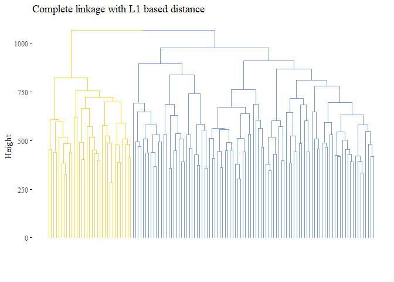<!-- -->

``` r
cutted <- cutree(h_cluster_l1_complete, 2)
ARI_h_cluster_l1_complete_3 <- adjustedRandIndex(truth,cutted)
print(ARI_h_cluster_l1_complete_3)
```

    ## [1] 1

``` r
set.seed(42)
max_dist = dist(scale_data, method="max")
h_cluster_max_average <- hclust((max_dist), method="average")
fviz_dend(h_cluster_max_average, 
          main="Average linkage with max based distance", 
          k=2,palette= "d3", show_labels=F, ggtheme= ggthemes::theme_tufte())
```

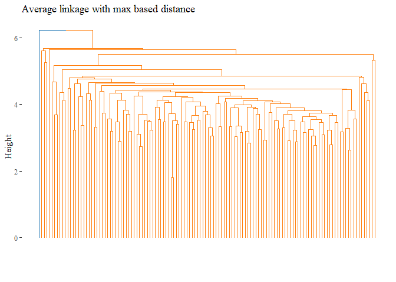<!-- -->

``` r
cutted <- cutree(h_cluster_max_average, 2)
ARI_h_cluster_max_average_3 <- adjustedRandIndex(truth,cutted)
print(ARI_h_cluster_max_average_3)
```

    ## [1] -0.0101038

``` r
set.seed(42)
h_cluster_max_complete <- hclust((max_dist), method="complete")
fviz_dend(h_cluster_max_complete, 
          main="Complete linkage with max based distance", 
          k=2, palette= "d3", show_labels=F, ggtheme= ggthemes::theme_tufte())
```

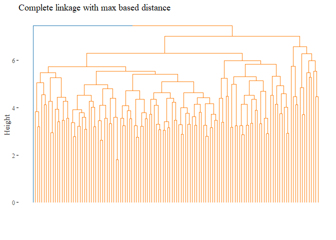<!-- -->

``` r
cutted <- cutree(h_cluster_max_complete, 2)
ARI_h_cluster_max_complete_3 <- adjustedRandIndex(truth,cutted)
print(ARI_h_cluster_max_complete_3)
```

    ## [1] -0.0101038

``` r
results_third <- data.frame(Value=c(ARI_h_avg_reduced_3,
                                    ARI_h_complete_reduced_3,
                                    ARI_h_average_reduced_3,
                                    ARI_h_corr_complete_reduced_3,
                                    ARI_h_cluster_l1_average_3,
                                    ARI_h_cluster_l1_complete_3,
                                    ARI_h_cluster_max_average_3,
                                    ARI_h_cluster_max_complete_3),
                            Names= c("Average euclidean_3", 
                                     "Complete euclidean_3",
                                     "Average correlation_3",
                                     "Complete correlation_3",
                                     "Complete L1_3",
                                     "Average L1_3",
                                     "Average Max_3",
                                     "Complete Max_3"))
```

``` r
ggplot(data=results_third, aes(y=reorder(Names, +Value), x=Value, fill=Names))+
  geom_bar(stat="identity")+ggtitle("Ari ~ Methods")+
  theme_tufte()+theme(legend.position = "none")+ylab("Method")
```

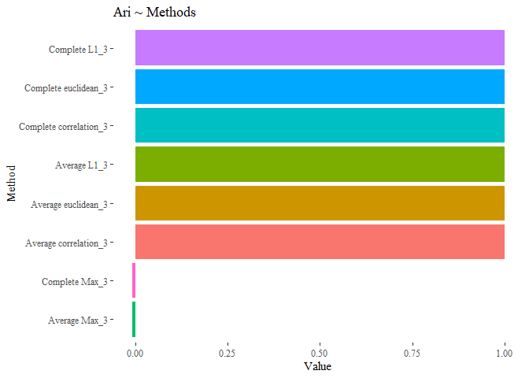<!-- -->

Seems that with this last methods the results are improved, the cluster
analysis is equal to the subtype!.

To have a final understanding on our methods let’s have one unique bar
plot having all the similarity together:

``` r
final <- rbind(results_first, results_second,results_third)
ggplot(data=final, aes(y=reorder(Names, +Value), x=Value, fill=Names))+
  geom_bar(stat="identity")+theme_tufte()+
  ggtitle("Final ARI comparison between methods")+
  theme(legend.position = "none")+ ylab("Method")
```

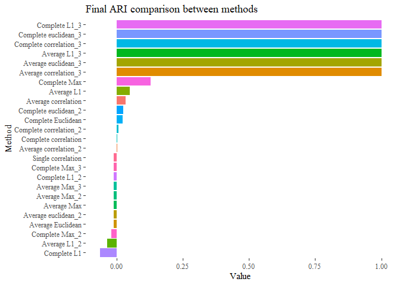<!-- -->

Taking only the genes that vary the most across all the results
improved!
