Shrinkage Methods, Trees and Forests
================
Ghisleni Gabriele
20/4/2021

> > ## Exercise 1
> >
> > Consider the “fat” dataset provided for this Homework (tab-separated
> > fat.tsv). It contains percent body fat, age, weight, height and body
> > circumference measurements for 252 male subjects. Our goal is to
> > predict body fat (variable y in the dataset) from the other
> > explanatory variables.

> ### 1. Load the data and perform a first exploratory analysis

We start loading our data set and perform some data-exploratory
analysis. For instance we will see how the data looks like and then
check the format, the possible presence of NA’s, the descriptive
statistics and we will plot some features to understand properly our
data set. Let’s start by seeing what is inside our data.

``` r
library(pander)
data = read.table("fat.tsv", header=T)
pander(head(data,2))
```

|  y   | siri | density | age | weight | height | neck | chest | abdomen | hip  |
|:----:|:----:|:-------:|:---:|:------:|:------:|:----:|:-----:|:-------:|:----:|
| 12.6 | 12.3 |  1.071  | 23  | 154.2  | 67.75  | 36.2 | 93.1  |  85.2   | 94.5 |
| 6.9  | 6.1  |  1.085  | 22  | 173.2  | 72.25  | 38.5 | 93.6  |   83    | 98.7 |

Table continues below

| thigh | knee | ankle | biceps | forearm | wrist |
|:-----:|:----:|:-----:|:------:|:-------:|:-----:|
|  59   | 37.3 | 21.9  |   32   |  27.4   | 17.1  |
| 58.7  | 37.3 | 23.4  |  30.5  |  28.9   | 18.2  |

We start by checking if there are some NA’s and in case handle them:

``` r
print(sum(data[is.na(data)]))  #counting NA's
```

    ## [1] 0

We do not have any NA’s. We proceed looking how our date are encoded
checking the type of each variable:

``` r
str(data)
```

    ## 'data.frame':    252 obs. of  16 variables:
    ##  $ y      : num  12.6 6.9 24.6 10.9 27.8 20.6 19 12.8 5.1 12 ...
    ##  $ siri   : num  12.3 6.1 25.3 10.4 28.7 20.9 19.2 12.4 4.1 11.7 ...
    ##  $ density: num  1.07 1.09 1.04 1.08 1.03 ...
    ##  $ age    : int  23 22 22 26 24 24 26 25 25 23 ...
    ##  $ weight : num  154 173 154 185 184 ...
    ##  $ height : num  67.8 72.2 66.2 72.2 71.2 ...
    ##  $ neck   : num  36.2 38.5 34 37.4 34.4 39 36.4 37.8 38.1 42.1 ...
    ##  $ chest  : num  93.1 93.6 95.8 101.8 97.3 ...
    ##  $ abdomen: num  85.2 83 87.9 86.4 100 94.4 90.7 88.5 82.5 88.6 ...
    ##  $ hip    : num  94.5 98.7 99.2 101.2 101.9 ...
    ##  $ thigh  : num  59 58.7 59.6 60.1 63.2 66 58.4 60 62.9 63.1 ...
    ##  $ knee   : num  37.3 37.3 38.9 37.3 42.2 42 38.3 39.4 38.3 41.7 ...
    ##  $ ankle  : num  21.9 23.4 24 22.8 24 25.6 22.9 23.2 23.8 25 ...
    ##  $ biceps : num  32 30.5 28.8 32.4 32.2 35.7 31.9 30.5 35.9 35.6 ...
    ##  $ forearm: num  27.4 28.9 25.2 29.4 27.7 30.6 27.8 29 31.1 30 ...
    ##  $ wrist  : num  17.1 18.2 16.6 18.2 17.7 18.8 17.7 18.8 18.2 19.2 ...

We have only numerical variables, included also our variable target (y
which is the body fat).

Now we try to understand if there are some correlations between the
variables and how they are related to the y.

``` r
library(ggcorrplot)
library(ggplot2)
library(ggthemes)

cov_matrix <- cor(data)
ggcorrplot(cov_matrix, method="square", type="lower", title="Correlation plot\n", 
           ggtheme=theme_tufte(), show.diag=F)
```

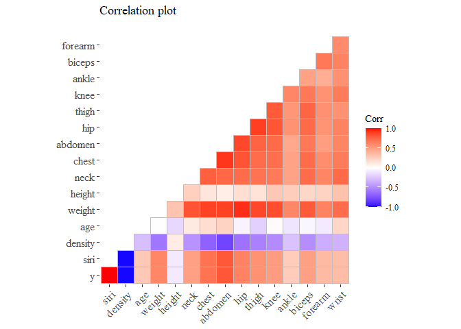<!-- -->

We removed the diagonal so to remove redundant information We start
analyzing the variables that seems more correlated to our y. I arbitrary
choose the ones with corr grater than 0.6 or corr less than -0.6

``` r
pander(cov_matrix[cov_matrix[,1]>0.6 | cov_matrix[,1]<(-0.6),1], 
       caption="Correlation with y", justify="center" ) 
```

|  y  |  siri  | density | weight | chest  | abdomen |  hip   |
|:---:|:------:|:-------:|:------:|:------:|:-------:|:------:|
|  1  | 0.9997 | -0.9881 | 0.6132 | 0.7029 | 0.8137  | 0.6257 |

From this correlation plot we can see that there are few variables that
seems correlated to our variable target.

**we can also see that we have two independent variables that are very
highly correlated with the body fat, we definitely should remove one of
them (or both) because the risk to run into the multi-collinearity
problems**. \[I noticed that the 5. is related to this so i do not
remove them on purpose\]

``` r
library(gridExtra)
library(grid)
library(ggthemes)
g1 <- ggplot(data=data, aes(y=y))+
  geom_line(data=data, aes(x=siri), colour="royalblue", lwd=0.7)+theme_tufte()+
  labs(subtitle="Siri")+xlab("")
g2 <- ggplot(data=data, aes(y=y))+
  geom_line(data=data, aes(x=density), colour="firebrick3", lwd=0.7)+theme_tufte()+
  labs(subtitle="Density")+xlab("")
g3 <- ggplot(data=data, aes(y=y))+
  geom_line(data=data, aes(x=hip), colour="gold", lwd=0.7)+theme_tufte()+
  labs(subtitle="Hip")+xlab("")
g4 <- ggplot(data=data, aes(y=y))+
  geom_line(data=data, aes(x=abdomen), colour="salmon", lwd=0.7)+theme_tufte()+
  labs(subtitle="Abdomen")+xlab("")
g5 <- ggplot(data=data, aes(y=y))+
  geom_line(data=data, aes(x=weight), colour="green", lwd=0.7)+theme_tufte()+
  labs(subtitle="Weight")+xlab("")
g6 <- ggplot(data=data, aes(y=y))+
  geom_line(data=data, aes(x=chest), colour="khaki3", lwd=0.7)+theme_tufte()+
  labs(subtitle="Chest")+xlab("")
grid.arrange(g1,g2,g3,g4,g5,g6, top=textGrob("Y ~ Most correlated variables\n"))
```

<!-- -->

As shown in the plot above we can see that we have two variabiles
perfectly correlated with the target variable: ‘siri’ and ‘density’ have
almost a perfect positive and negative correlation respectively of
0.9997, -0,9881.

Let’s also see the distribution of these variables:

``` r
g1 <- ggplot(data=data, aes(x=siri))+
  geom_histogram(fill="royalblue", colour="black",bins=30)+theme_tufte()+
  labs(subtitle="Siri")+xlab("")
g2 <- ggplot(data=data, aes(x=density))+
  geom_histogram(fill="firebrick3", colour="black",bins=30)+theme_tufte()+
  labs(subtitle="Density")+xlab("")
g3 <- ggplot(data=data, aes(x=hip))+
  geom_histogram(fill="gold", colour="black",bins=30)+theme_tufte()+
  labs(subtitle="Hip")+xlab("")
g4 <- ggplot(data=data, aes(x=abdomen))+
  geom_histogram(fill="salmon", colour="black",bins=30)+theme_tufte()+
  labs(subtitle="Abdome")+xlab("")
g5 <- ggplot(data=data, aes(x=weight))+
  geom_histogram(fill="green", colour="black",bins=30)+theme_tufte()+
  labs(subtitle="Weight")+xlab("")
g6 <- ggplot(data=data, aes(x=chest))+
  geom_histogram(fill="khaki3", colour="black",bins=30)+theme_tufte()+
  labs(subtitle="Chest")+xlab("")

grid.arrange(g1,g2,g3,g4,g5,g6, 
             top=textGrob("Histogram distribution of the most important variable\n"))
```

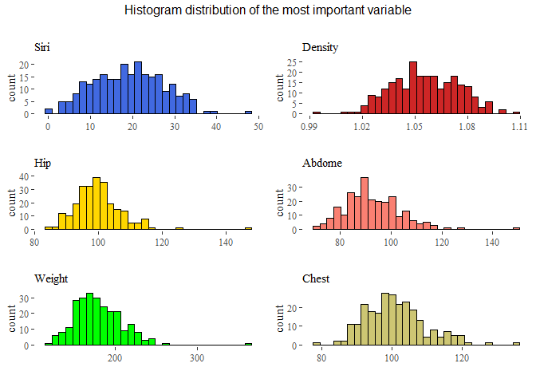<!-- -->

We can see that the distributions are almost standard, but seems that
there are some outliers in each of these features. So before conclude
this part we will see boxplots to understand the situation with
outliers.

``` r
g1 <- ggplot(data=data, aes(x=siri))+
  geom_boxplot(fill="royalblue")+theme_tufte()+labs(subtitle="Siri")+xlab("")
g2 <- ggplot(data=data, aes(x=density))+
  geom_boxplot(fill="firebrick3")+theme_tufte()+labs(subtitle="Density")+xlab("")
g3 <- ggplot(data=data, aes(x=hip))+
  geom_boxplot(fill="gold")+theme_tufte()+labs(subtitle="Hip")+xlab("")
g4 <- ggplot(data=data, aes(x=abdomen))+
  geom_boxplot(fill="salmon")+theme_tufte()+labs(subtitle="Abdome")+xlab("")
g5 <- ggplot(data=data, aes(x=weight))+
   geom_boxplot(fill="green")+theme_tufte()+labs(subtitle="Weight")+xlab("")
g6 <- ggplot(data=data, aes(x=chest))+
  geom_boxplot(fill="khaki3")+theme_tufte()+labs(subtitle="Chest")+xlab("")

grid.arrange(g1,g2,g3,g4,g5,g6, 
             top=textGrob("BoxPlot of the most importance variables\n"))
```

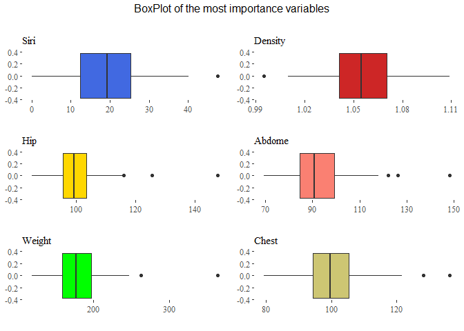<!-- -->

From here we can see that there are many outliers in particular in the
variable thigh, chest, abdomen and hip. Let’s also analyze our target
variable:

``` r
mu <- round(mean(data$y),2)
sdt <- round(sd(data$y),2)
x <- 0:50
y <- dnorm(x, mu, sdt)
distribution_y <- data.frame(X=x, Y=y)

g1 <- ggplot(data=data, aes(y=y))+
  geom_boxplot(fill="darkseagreen4")+theme_tufte()+labs(subtitle="Boxplot of y")

g2 <- ggplot(data=data, aes(x=y, y=..density..))+
  geom_histogram(fill="darkseagreen4",colour="black",bins=30)+
  geom_line(data=distribution_y, aes(x=X, y=Y, 
  colour=paste("Normal distribution (",mu,",",sdt,")")), lwd=1.5)+
  scale_color_manual("", values = c("indianred4"))+
  theme_tufte()+theme(legend.position="top")+labs(subtitle="Histogram of y")

grid.arrange(g1,g2, nrow=1, top=textGrob("Body fat\n"))
```

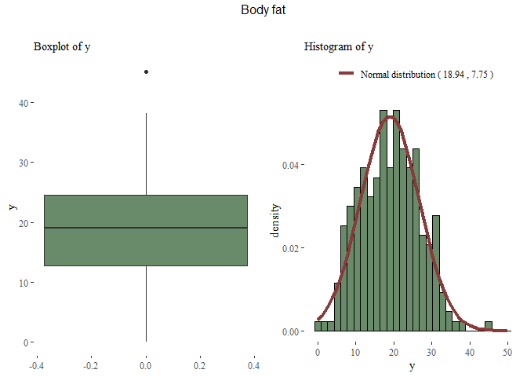<!-- -->

Now that we have a rough idea of our data, we can start perform data
analysis.

> ### 2. Split the data into train/test

We will use a 66-33 proportion in our splitting.

``` r
set.seed(42)
r <-sample(nrow(data), nrow(data)*0.33)
train <- data[-r,]
test_x <- data[r, -1]
test_y <- data[r, 1]
```

> ### 3. Perform least squares regression to predict y from the other variables.

We fit a simple linear regression and try to investigate how it behave.

``` r
reg1 <- lm(data=train, y~.)
pander(summary(reg1))
```

|                 | Estimate  | Std. Error | t value | Pr(>\|t\|) |
|:---------------:|:---------:|:----------:|:-------:|:----------:|
| **(Intercept)** |   10.03   |   4.529    |  2.213  |  0.02834   |
|    **siri**     |  0.9022   |  0.009593  |  94.05  | 2.801e-137 |
|   **density**   |  -9.344   |   4.053    | -2.305  |  0.02249   |
|     **age**     | 6.033e-05 |  0.00171   | 0.03527 |   0.9719   |
|   **weight**    | -0.003338 |  0.003192  | -1.045  |   0.2975   |
|   **height**    |  0.01152  |  0.009023  |  1.276  |   0.2038   |
|    **neck**     | -0.01179  |  0.01159   | -1.017  |   0.3106   |
|    **chest**    | 0.007501  |  0.005542  |  1.354  |   0.1779   |
|   **abdomen**   | 0.006506  |  0.005755  |  1.131  |    0.26    |
|     **hip**     | 0.002835  |  0.008441  | 0.3359  |   0.7374   |
|    **thigh**    |  0.01565  |  0.007036  |  2.225  |  0.02756   |
|    **knee**     | -0.03282  |  0.01323   |  -2.48  |  0.01422   |
|    **ankle**    | 0.002317  |  0.009943  |  0.233  |   0.816    |
|   **biceps**    | -0.01236  |  0.008852  | -1.396  |   0.1648   |
|   **forearm**   |  0.01754  |  0.01008   |  1.739  |  0.08397   |
|    **wrist**    |  0.01466  |  0.02741   | 0.5349  |   0.5935   |

| Observations | Residual Std. Error | *R*<sup>2</sup> | Adjusted *R*<sup>2</sup> |
|:------------:|:-------------------:|:---------------:|:------------------------:|
|     169      |        0.177        |     0.9995      |          0.9995          |

Fitting linear model: y \~ .

Using a standard linear regression we can see that the variables having
a lower p-value (which means the probability to see those data if the
feature is not significant aka =0) are: ‘density’, ‘siri’ and ‘thigh’,
‘knee’ and last ‘forearm’ with p-value around 8%. the R^2 is very low
and also the residual standard error is very low.

Let’s see the MSE on test error with this model:

``` r
test_prediction <- predict(reg1, test_x)
MSE_N<- mean((test_y-test_prediction)^2)
print(paste("The mean square error on the test set is: ",MSE_N))
```

    ## [1] "The mean square error on the test set is:  0.0343231476007284"

The mean square error is very low and the R^2 is very high. Seems that
we are performing a perfect regression. *Is possible that something
strange is happening*.

> ### 4. Apply ridge regression and the lasso to the same data.

-   Plot the coefficients as a function of lambda
-   Plot the cross-validation MSE as a function of lambda and find the
    optimal lambda
-   Compute the test MSE of the optimal model
-   Examine the coefficients of the optimal mode

> ### 1) Ridge Regression

Since we have many coefficients we can perform shrinkage regression as
ridge or lasso. Those models basically change the way that the
regression line is found adding a constrained in the formula (as in
Lagrange optimization) that limits the impact of predictors.

in Ridge regression the formula is:
$$\\mathit{\\widehat{\\beta}= arg\\ min \\ RSS + \\lambda \\sum\_{j=1}^{p} \\beta\_{j}^{2}}$$

The result will be a model having more bias but at the same time less
variance. *We also perform a standardization of the variables since this
affect the ridge and lasso regression!*

``` r
# We must transform the data frame into a matrix (requirement of the function)
train_mat_x <- scale(model.matrix(y ~ ., data=data[-r,])[, -1])
test_mat_x <- scale(model.matrix(y ~ ., data=data[r,])[, -1])
train_y <- data[-r,1]
test_y <- data[r,1]
paste("Dimension original df: ",
             dim(train)[1],
             dim(train)[2],
             "Dimension of the new matrix (we left out y): ",
             dim(train_mat_x)[1], dim(train_mat_x)[2])
```

    ## [1] "Dimension original df:  169 16 Dimension of the new matrix (we left out y):  169 15"

We start performing a ridge regression, we must specify the parameter
alpha which could be used in two different way: if *alpha=0 means ridge
regression* while alpha=1 means lasso regression. Also important is the
parameter lambda which represent the weight of the penalization of the
betas (as shown in the formula), by default R try to guess a vector,
instead if we explicit pass an array R will use those. We start perform
a normal ridge regression, see the results and then optimized the result
obtained using cross validation.

``` r
library(glmnet)
set.seed(42)
lambdas <- 10^seq(10, -2, length=100)
ridge_regression <- glmnet(train_mat_x, train_y, alpha=0, lambda=lambdas)
plot(ridge_regression)
```

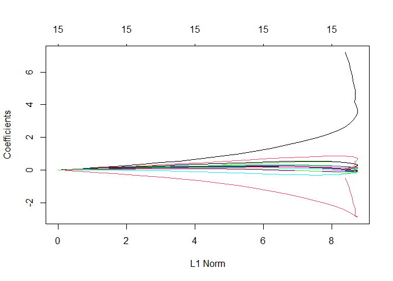<!-- --> From this plot is
clear that there are two variables that impact a lot the performance of
the model, most probably the ones that were highly correlated: ‘siri’
and ‘density’.

Now we perform the same operation evaluating the performance in term of
MSE with cross-validation.

``` r
ridge_regression <- cv.glmnet(train_mat_x, train_y, alpha=0, lambda=lambdas)
coeff_ridge<- predict(ridge_regression, type="coefficients", s=lambdas)
```

We also plot the MSE \~ lambdas (and on the top the number of features
used into the model).

``` r
plot(ridge_regression)
```

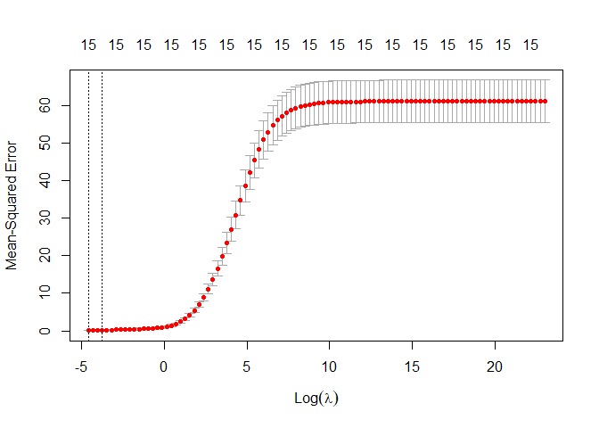<!-- -->

From the plot above we can see that the optimal lambda is very low, also
the confidence interval in small. we also notice as before that the MSE
is very low.

``` r
# we can also find the optimal lambda as:
opti_lamda_ridge_n <- ridge_regression$lambda.min
print(paste("The optimal of ridge regression lambda is: ",opti_lamda_ridge_n))
```

    ## [1] "The optimal of ridge regression lambda is:  0.01"

-   Compute the test MSE of the optimal model

``` r
set.seed(42)
ridge_prediction <- predict(ridge_regression, s=opti_lamda_ridge_n,test_mat_x)
MSE_ridge_N <- mean((ridge_prediction - test_y)^2)
print(paste("MSE Test Ridge (optimal lambda):", MSE_ridge_N))
```

    ## [1] "MSE Test Ridge (optimal lambda): 0.501108803453915"

The MSE is slightly higher than a normal linear regression. This could
means that the variance inside the data is very low and biased model
performs worst than an unbiased model.

-   Examine the coefficients of the optimal model

``` r
set.seed(42)
ridge_coeff_best_lambda <- predict(ridge_regression, type="coefficients",
                                   s=ridge_regression$lambda.min)

tmp<-data.frame(name=ridge_coeff_best_lambda@Dimnames[1], 
                value = ridge_coeff_best_lambda@x)
colnames(tmp)<- c("Names", "Values")
pander(tmp)
```

|    Names    |  Values   |
|:-----------:|:---------:|
| (Intercept) |   18.71   |
|    siri     |   7.197   |
|   density   |  -0.5136  |
|     age     |  0.01446  |
|   weight    |  -0.112   |
|   height    |  0.0388   |
|    neck     |  -0.029   |
|    chest    |  0.08883  |
|   abdomen   |  0.08268  |
|     hip     |  0.04257  |
|    thigh    |  0.08457  |
|    knee     |  -0.0942  |
|    ankle    | -0.001544 |
|   biceps    | -0.04753  |
|   forearm   |  0.04475  |
|    wrist    |  0.01303  |

We can see that none of them is exactly zero, because we are performing
a Ridge regression which brings them near to zero but not exactly. The
most important variable for this ridge regression are ‘siri’ with 7
(very high) and ‘density’ with -0.5 Now that we do the same procedure
with lasso we expect to see some of them equal to zero.

> ### 2) Lasso Regression

The idea is the same as the Ridge regression, a shrinkage regression
that results in a model with high bias but low variance. in this case
the formula is slightly different and it bring down to zero the
coefficients that are useless.

Lasso Formula:
$$\\mathit{\\widehat{\\beta}= arg\\ min\\ RSS + \\lambda \\sum\_{j=1}^{p} \\left \\\|\\beta\_{j}\\right \\\|}$$

As we did before we prepare the data:

``` r
train_mat_x <- scale(model.matrix(y ~ ., data=data[-r,])[, -1])
test_mat_x <- scale(model.matrix(y ~ ., data=data[r,])[, -1])
train_y <- data[-r,1]
test_y <- data[r,1]
```

We change the parameter alpha from 0 to 1, as we said before **alpha = 1
means Lasso**.

``` r
set.seed(42)
lambdas <- 10^seq(10, -2, length=100)
lasso_regression <- glmnet(train_mat_x, train_y, alpha=1, lambda=lambdas)
plot(lasso_regression)
```

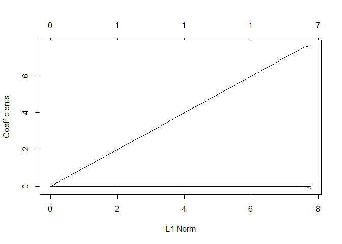<!-- -->

There are almost all zero except for once, which is very bad. basically
the model use just one variable to make the prediction, which most
probably is going to be ‘siri’.

As before first we plot the curvature of the features according to the
lambdas and then we find the best option with cross validation.

``` r
lasso_regression <- cv.glmnet(train_mat_x, train_y, alpha=1, lambda=lambdas) 
coeff_lasso<- predict(lasso_regression, type="coefficients", s=lambdas)
```

-   Plot the cross-validation MSE as a function of lambda and find the
    optimal

``` r
plot(lasso_regression)
```

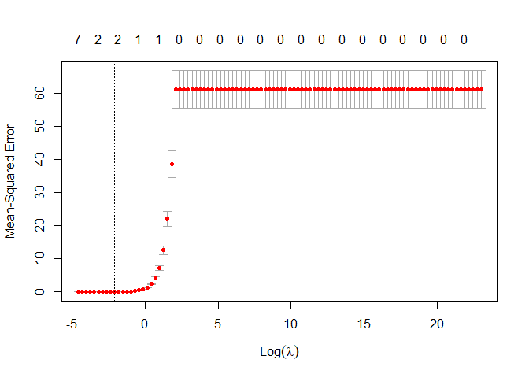<!-- --> Different from
before in top of the plot we have the number of variables different from
zero used in the lasso regression. When lambda increase, in this case
when lambda is greater than exp(4) all the variables are dropped out
from the models. From this plot R is telling us that the best choice of
lambda bring to use just two variable (probably the most correlated),
let’s see better which is the optimal lambda and what are the features
that are different from zero.

-   Optimal Lambda:

``` r
optima_lambda_n<-lasso_regression$lambda.min
print(paste("The optimal lambda for lasso regression is: ",optima_lambda_n))
```

    ## [1] "The optimal lambda for lasso regression is:  0.0305385550883341"

-   MSE in test set:

``` r
set.seed(42)
lasso_prediction <- predict(lasso_regression, s=optima_lambda_n, test_mat_x)
MSE_Lasso_n <- mean((lasso_prediction - test_y)^2)
print(paste("MSE Test Lasso (optimal lambda) =",MSE_Lasso_n))
```

    ## [1] "MSE Test Lasso (optimal lambda) = 0.489189788278689"

The MSE is slightly higher than a normal regression but very similar to
the ridge regression MSE.

``` r
set.seed(42)
lasso_coeff_best_lambda <- predict(lasso_regression, 
                                   type="coefficients", s=lasso_regression$lambda.min)
#create the data frame just to represent purpose. to check remove comment the line below.
#lasso_coeff_best_lambda #the . stand for zero
tmp<- data.frame(Names=c("Intercept","siri","density","abdomen"), 
                 values=lasso_coeff_best_lambda@x)
pander(tmp)
```

|   Names   |  values   |
|:---------:|:---------:|
| Intercept |   18.71   |
|   siri    |   7.662   |
|  density  | -0.09804  |
|  abdomen  | 0.0001307 |

> #### 5. Critically evaluate the results you obtained. If they look suspicious, think about a possible cause.
>
> For example, examine the coefficients of the least square regression
> model (estimate and sign), together with the R2 value; compute the
> pairwise correlations between the variables, . . . Think of a
> modification of the analysis in light of your findings and repeat
> steps 1-4 of your new analysis. Comment on the new results.

The results look suspicious, there are a perfect correlation between the
y and two other variable: 0.9777 with ‘siry’ and -0.9881 with ‘density’.
the R^2 is also perfect.

After have done a quick research i found that ‘siry’ and ‘density’ are
basically the same as the body fat so having them in the predictors mean
that the model will use only those.

The result is correct but since having those implies in a certain way
already know the body fat we are not increasing our knowledge on the
problem (since we are using the equivalent of body fact to predict body
fact) so i decided to remove them and see what are the predictors inside
our data set that can be used to predict it without already have the
answer encoded in a different variable..

So now we perform the same operations this time removing ‘siri’ and
‘density’. From now on we will call *adjusted* all the models without
those two variables.

> ### 1) Normal regression adjusted

``` r
set.seed(42)
r <-sample(nrow(data), nrow(data)*0.33)
train <- data[-r, -2:-3]
test_x <- data[r, -1:-3]
test_y <- data[r, 1]
reg1 <- lm(data=train, y~.)
pander(summary(reg1))
```

|                 | Estimate | Std. Error | t value | Pr(>\|t\|) |
|:---------------:|:--------:|:----------:|:-------:|:----------:|
| **(Intercept)** |  -37.06  |   26.71    | -1.387  |   0.1673   |
|     **age**     | 0.07695  |  0.03841   |  2.003  |   0.0469   |
|   **weight**    | -0.1224  |  0.07222   | -1.695  |  0.09213   |
|   **height**    | 0.09176  |   0.2054   | 0.4466  |   0.6558   |
|    **neck**     | -0.3141  |   0.2633   | -1.193  |   0.2347   |
|    **chest**    | 0.02105  |   0.1255   | 0.1678  |   0.867    |
|   **abdomen**   |  0.8895  |   0.1086   |  8.194  | 8.868e-14  |
|     **hip**     | -0.08595 |   0.1918   | -0.4482 |   0.6546   |
|    **thigh**    |  0.3274  |   0.1584   |  2.067  |  0.04042   |
|    **knee**     | -0.4099  |   0.3001   | -1.366  |   0.174    |
|    **ankle**    |  0.2228  |   0.225    |  0.99   |   0.3237   |
|   **biceps**    | 0.07718  |   0.201    | 0.3839  |   0.7015   |
|   **forearm**   |  0.6479  |   0.2245   |  2.886  |  0.004464  |
|    **wrist**    |  -1.432  |   0.6137   | -2.333  |  0.02094   |

| Observations | Residual Std. Error | *R*<sup>2</sup> | Adjusted *R*<sup>2</sup> |
|:------------:|:-------------------:|:---------------:|:------------------------:|
|     169      |        4.041        |     0.7516      |          0.7307          |

Fitting linear model: y \~ .

``` r
test_prediction <- predict(reg1, test_x)
MSE<- mean((test_y-test_prediction)^2)
print(paste("The mean square error on the test set is: ",MSE))
```

    ## [1] "The mean square error on the test set is:  17.0771332847323"

We can directly see that the results will be very different. The
significant variables are now age, abdomen, thigh, forearm, wrist and
weight with p-value at 9%. The R^2 is not perfect anymore, and the
residual standard error is much higher compared to before which was
almost null.

> ### 2) Ridge adjusted

Since we already explain what happen before now we will only represent
the results consider the reduced data set comparing the results with
what we obtained before.

``` r
set.seed(42)
# reprocess data
train_mat_x <- scale(model.matrix(y ~ ., data=data[-r,])[, -3:-1])
test_mat_x <- scale(model.matrix(y ~ ., data=data[r,])[, -3:-1])
train_y <- data[-r,1]
test_y <- data[r,1]
#create range of lambda
lambdas <- 10^seq(10, -2, length=100)
ridge_regression <-glmnet(train_mat_x, train_y, alpha=0, lambda=lambdas)
plot(ridge_regression)
```

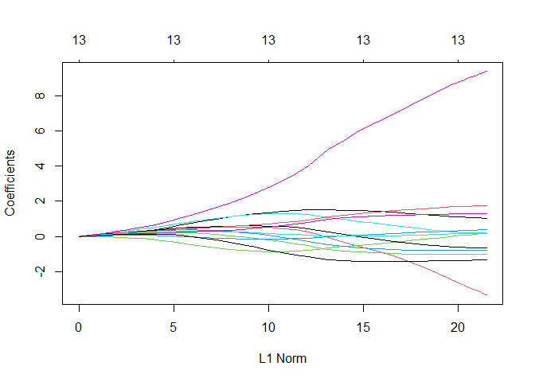<!-- -->

Now the variables that are not pushed down to almost zero are more and,
expect for one, have a similar weight.

Fit the best ridge regression with cross-validation:

``` r
#fit a ridge_regression and plot it
ridge_regression <- cv.glmnet(train_mat_x, train_y, alpha=0, lambda=lambdas) 
opti_lambda_ridge <- ridge_regression$lambda.min
plot(ridge_regression)
```

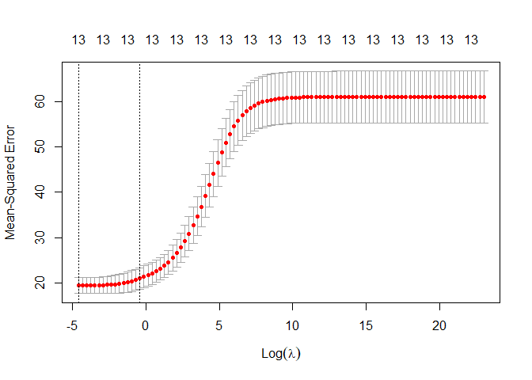<!-- -->

We can see now that the results are quiet different than before, the
confidence interval is larger. let’s go on and see others detail of this
regression as the optimal lambda, the MSE and the more important
features.

``` r
print(paste("The optimal of ridge regression lambda is: ",opti_lambda_ridge))
```

    ## [1] "The optimal of ridge regression lambda is:  0.01"

``` r
set.seed(42)
ridge_prediction <- predict(ridge_regression, s=opti_lambda_ridge, test_mat_x)
MSE_ridge <- mean((ridge_prediction - test_y)^2)
print(paste("MSE Test Ridge (optimal lambda):",MSE_ridge))
```

    ## [1] "MSE Test Ridge (optimal lambda): 16.3449890155978"

Now we can see that the ridge regression perform a few better than a
normal linear regression. In this case having increased the bias in the
training results in a better test performance.

While the coefficients are:

``` r
set.seed(42)
ridge_coeff_best_lambda <- predict(ridge_regression, type="coefficients",
                                   s=opti_lambda_ridge)

tmp<-data.frame(name=ridge_coeff_best_lambda@Dimnames[1], 
                value = ridge_coeff_best_lambda@x)
colnames(tmp)<- c("Names", "Values")
pander(tmp)
```

|    Names    | Values  |
|:-----------:|:-------:|
| (Intercept) |  18.71  |
|     age     |  1.026  |
|   weight    | -3.328  |
|   height    | 0.1834  |
|    neck     | -0.7909 |
|    chest    | 0.1799  |
|   abdomen   |  9.362  |
|     hip     | -0.6348 |
|    thigh    |  1.753  |
|    knee     | -1.021  |
|    ankle    | 0.3834  |
|   biceps    | 0.2129  |
|   forearm   |  1.313  |
|    wrist    | -1.328  |

Now that we removed the problems of multi-collinearity and standardized
our data the results seems more reliable in fact there are more
variables that contribute to the prediction.

> ### 3) Lasso adjusted

Since we already explain what happen before now we will only represent
the results consider the reduced data set comparing the results with
what we obtained before.

``` r
set.seed(42)
# preprocess data
train_mat_x <- scale(model.matrix(y ~ ., data=data[-r,])[, -3:-1])
test_mat_x <- scale(model.matrix(y ~ ., data=data[r,])[, -3:-1])
train_y <- data[-r,1]
test_y <- data[r,1]
#create range of lambda
lambdas <- 10^seq(10, -2, length=100)
lasso_regression <-glmnet(train_mat_x, train_y, alpha=1, lambda=lambdas)
plot(lasso_regression)
```

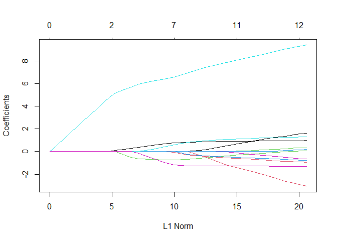<!-- --> Seems that there
is again one variable which is stronger than the others but overall is
fine because the others are not all zero.

Find the best lasso regression with cross-validation:

``` r
#fit a ridge_regression and plot it
lasso_regression <- cv.glmnet(train_mat_x, train_y, alpha=1, lambda=lambdas) 
opti_lambda_lasso <- lasso_regression$lambda.min
plot(lasso_regression)
```

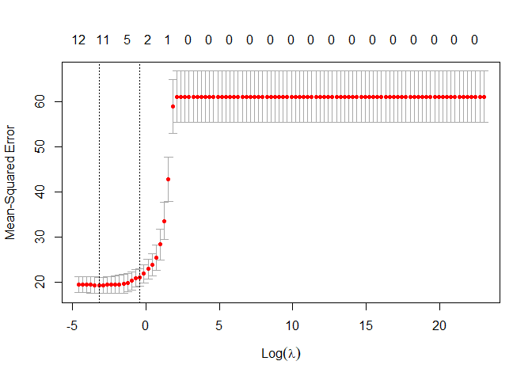<!-- -->

We can see now that the results are quiet different than before, the
number of variables suggested to the optimal lasso regression are
between 11 and 5. let’s go on and see others detail of this regression
as the optimal lambda, the MSE and the more important features.

``` r
print(paste("The optimal of Lasso regression lambda is: ",opti_lambda_lasso))
```

    ## [1] "The optimal of Lasso regression lambda is:  0.0403701725859655"

``` r
lasso_prediction <- predict(lasso_regression, s=opti_lambda_lasso, test_mat_x)
MSE_lambda <- mean((lasso_prediction - test_y)^2)
print(paste("MSE Test Lasso (optimal lambda):",MSE_lambda))
```

    ## [1] "MSE Test Lasso (optimal lambda): 15.9684828449859"

Also in this case the performance is better than the normal linear
regression.

We can also control which variables are not reduced to zero:

``` r
set.seed(42)
lasso_coeff_best_lambda <- predict(lasso_regression, type="coefficients",
                                   s=opti_lambda_lasso)


#create the dataframe just to represent purpose. #to check decomment the line below. 
#lasso_coeff_best_lambda #the . stand for zero!
pander(data.frame(name= c("intercept",colnames(train_mat_x)[-6]), 
                  values=lasso_coeff_best_lambda@x))
```

|   name    |  values  |
|:---------:|:--------:|
| intercept |  18.71   |
|    age    |  0.955   |
|  weight   |  -2.336  |
|  height   | -0.07042 |
|   neck    | -0.6513  |
|   chest   |  8.817   |
|    hip    | -0.4268  |
|   thigh   |  1.247   |
|   knee    | -0.8114  |
|   ankle   |  0.2113  |
|  biceps   | 0.04338  |
|  forearm  |  1.235   |
|   wrist   |  -1.286  |

Now that we have all the elements we can compare them all and try to
draw some conclusion about this analysis.

``` r
df1 <-(data.frame(
  Regression=c("Normal regression adj","Lasso adj","Ridge adj"),
  MSE=c(MSE,MSE_lambda, MSE_ridge),
  optimal_lambda=c(0,opti_lambda_lasso,opti_lambda_ridge),    
  Removed_variability=("sini, density")))
df2 <- data.frame(
  Regression=c("Normal regression","Lasso","Ridge"),
  MSE=c(MSE_N,MSE_Lasso_n, MSE_ridge_N),
  optimal_lambda=c(0,optima_lambda_n,opti_lamda_ridge_n),    
  Removed_variability=("None"))
df_tot <- rbind(df1,df2)
df_tot <- df_tot[order(df_tot$Regression),]
rownames(df_tot)<-NULL
pander(df_tot, caption="For adj means without sini and density")
```

|      Regression       |   MSE   | optimal_lambda | Removed_variability |
|:---------------------:|:-------:|:--------------:|:-------------------:|
|         Lasso         | 0.4892  |    0.03054     |        None         |
|       Lasso adj       |  15.97  |    0.04037     |    sini, density    |
|   Normal regression   | 0.03432 |       0        |        None         |
| Normal regression adj |  17.08  |       0        |    sini, density    |
|         Ridge         | 0.5011  |      0.01      |        None         |
|       Ridge adj       |  16.34  |      0.01      |    sini, density    |

For adj means without sini and density

As we can see from this table the regression without removing ‘sini’ and
density’ were almost perfect and with high probability false while the
other analysis seems more reliable. Basically using siri and density
inside the predictors means use something that results be the same as
the y so we do no use the other variables anymore but just that one.

To have a better idea we can also plot and see these results.

``` r
ggplot(data=df_tot, aes(y=MSE, x=reorder(Regression, -MSE), fill=Regression))+
  geom_bar(stat='identity')+ theme_tufte()+
  theme(legend.position="bottom",legend.title=element_blank())+
  ggtitle("MSE of the differents model")+ xlab("")
```

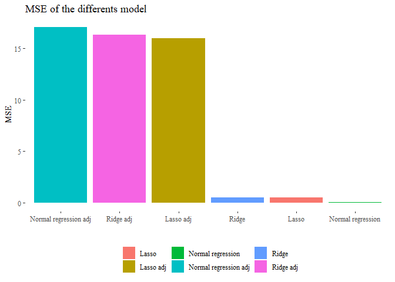<!-- -->

> > ## Exercise 2
> >
> > In this question, you will revisit the Hitters dataset. The goal is
> > to predict the salary of baseball players, as a quantitative
> > variable, from the other explanatory variables.

> ### 1. Split the data into train/test set

We already know that all the NAs are all in the column Salary so we
directly drop it.

``` r
set.seed(42)
data <- na.omit(ISLR::Hitters)
r <- sample(nrow(data), nrow(data)*0.33)
train <- data[-r,]
train_y <- data[-r, 19]
test_x <- data[r, -19]
test_y <- data[r, 19]
```

> ### 2. Fit a decision tree on the training data and plot the results.

We create a the tree as:

``` r
library(tree)
set.seed(42)
Tree1 <- tree(Salary ~ . , data=train)
(summary(Tree1))
```

    ## 
    ## Regression tree:
    ## tree(formula = Salary ~ ., data = train)
    ## Variables actually used in tree construction:
    ## [1] "CRuns"   "CAtBat"  "Hits"    "CHmRun"  "PutOuts" "Years"   "CHits"  
    ## Number of terminal nodes:  10 
    ## Residual mean deviance:  65070 = 10870000 / 167 
    ## Distribution of residuals:
    ##    Min. 1st Qu.  Median    Mean 3rd Qu.    Max. 
    ## -785.40  -99.17  -24.17    0.00  125.80 1458.00

Seems that the model is quiet simple, we have only 10 terminal nodes,
the residual mean is 65070.

Let’s first see what our tree is structured and then represent it as a
tree:

``` r
(Tree1)
```

    ## node), split, n, deviance, yval
    ##       * denotes terminal node
    ## 
    ##   1) root 177 41630000  558.1  
    ##     2) CRuns < 288 94  7002000  282.1  
    ##       4) CAtBat < 1257.5 61  4650000  192.7  
    ##         8) Hits < 40.5 5  3163000  669.5 *
    ##         9) Hits > 40.5 56   249400  150.2 *
    ##       5) CAtBat > 1257.5 33   963200  447.4 *
    ##     3) CRuns > 288 83 19350000  870.7  
    ##       6) Hits < 122.5 37  1848000  569.0 *
    ##       7) Hits > 122.5 46 11430000 1113.0  
    ##        14) CHmRun < 256.5 39  6016000 1005.0  
    ##          28) PutOuts < 1124.5 34  4101000  936.4  
    ##            56) Years < 9.5 19  2422000 1087.0  
    ##             112) CHits < 911 13   565100  926.0 *
    ##             113) CHits > 911 6   794600 1435.0 *
    ##            57) Years > 9.5 15   708900  746.3  
    ##             114) Years < 11.5 5   112100  490.4 *
    ##             115) Years > 11.5 10   105900  874.2 *
    ##          29) PutOuts > 1124.5 5   678500 1469.0 *
    ##        15) CHmRun > 256.5 7  2386000 1719.0 *

Basically this is telling us the structure of our tree. Starting from
the root we can see that we have 177 observation, at each row R is
telling us the criterion used to split the tree, the number of
observations that are left and how the deviance is dropped after the
splitting.

The first features used to split the tree are also the most
significative, so in this case the most important is CRuns followed by
Hits and CAtBat.

To be clear the deviance is basically the level of ‘impurity’ of the
tree that can be calculated usually with two methods: the Entropy or the
Gini index, both basically represent the level of homogeneity from that
node and below (starting from that, looking at the Tree in a recursive
way).

Let’s also plot the tree:

``` r
set.seed(42)
library(RColorBrewer)
library(rattle)
library(rpart)
fancyRpartPlot(rpart(Tree1),yesno=0,split.col="black",nn.col="black", 
               caption="",palette="Paired",branch.col="black")
```

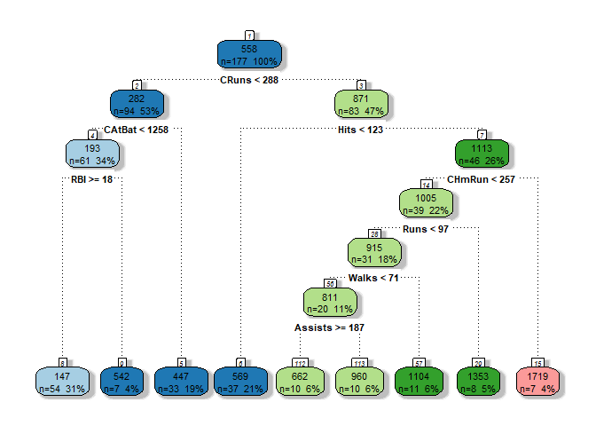<!-- -->

> ### 3. Chose the good trade off complexity - bias

To perform this operation we basically prune the tree looking for a good
trade off between complexity and bias. Tree are very affected to the
problem of overfitting. To do so we will use cross validation and with a
certain parameter k (which penalize the number of terminal nodes) we
will search for the best choice of k in terms of deviance.

``` r
library(pander)
set.seed(42)
cross_v_Tree1 <- cv.tree(object=Tree1, FUN=prune.tree)
tmp<-(data.frame(Size=cross_v_Tree1$size, K=cross_v_Tree1$k, Dev=cross_v_Tree1$dev))
pander(tmp)
```

| Size |    K     |   Dev    |
|:----:|:--------:|:--------:|
|  10  |   -Inf   | 28800868 |
|  9   |  490850  | 28646310 |
|  7   | 1016431  | 28183050 |
|  6   | 1236268  | 29125417 |
|  5   | 1237897  | 29125417 |
|  4   | 1388986  | 27836578 |
|  3   | 3025955  | 29704267 |
|  2   | 6077789  | 31253198 |
|  1   | 15269120 | 43179848 |

From this we are interested in k, which represent the value of the
cost-complexity parameter, and in dev which is the deviance (as we saw
before the level of impurity).

Let’s visually see how changes the deviance according to the value of k
and according to the size (number of terminal nodes) of the tree. we
expect to see that higher k means higher deviance and on contrary higher
size implies lower deviance.

``` r
#we removed the first obs with k -inf for graphical purpose.
g1 <- ggplot(data=tmp[-1,], aes(y=Dev, x=K))+
  geom_line(color="royalblue", lwd=1)+
  geom_point(color="royalblue", size=2)+theme_tufte()+
  labs(title="Dev ~ K", caption="obtained from cross validation")
g2 <- ggplot(data=tmp, aes(y=Dev, x=Size))+
  geom_line(color="firebrick", lwd=1)+geom_point(color="firebrick", size=2)+
  theme_tufte()+
  labs(title="Dev ~ Size",caption="obtained from cross validation")

grid.arrange(g1,g2, nrow=2)
```

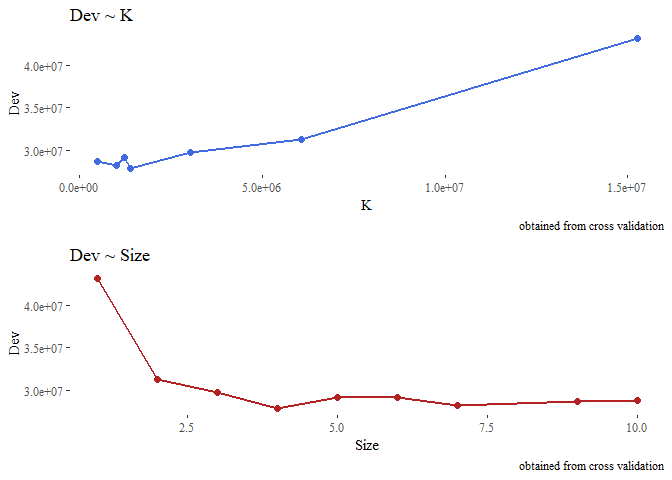<!-- -->

Now from the cross-validation we look at the tree size (number of
terminal nodes) having the lowest deviance, prune the first tree that we
created and see how it performs on the test set.

``` r
set.seed(42)
opti_size <- cross_v_Tree1$size[which.min(cross_v_Tree1$dev)]
pruned_Tree1 <- prune.tree(Tree1, best=opti_size)
summary(pruned_Tree1)
```

    ## 
    ## Regression tree:
    ## snip.tree(tree = Tree1, nodes = c(14L, 2L))
    ## Variables actually used in tree construction:
    ## [1] "CRuns"  "Hits"   "CHmRun"
    ## Number of terminal nodes:  4 
    ## Residual mean deviance:  99730 = 17250000 / 173 
    ## Distribution of residuals:
    ##    Min. 1st Qu.  Median    Mean 3rd Qu.    Max. 
    ## -785.40 -182.10  -82.13    0.00  142.90 1845.00

As expected now we have only 4 terminal nodes and a deviance is higher.
Let’s quickly compare it with the deviance of the full tree computed
before:

``` r
print(paste("Deviance of the full tree:", summary(Tree1)$dev))
```

    ## [1] "Deviance of the full tree: 10865937.4203605"

``` r
print(paste("Deviance of the pruned tree:", summary(pruned_Tree1)$dev))
```

    ## [1] "Deviance of the pruned tree: 17252799.8528633"

Let’s also plot this small tree:

``` r
plot(pruned_Tree1)
text(pruned_Tree1)
```

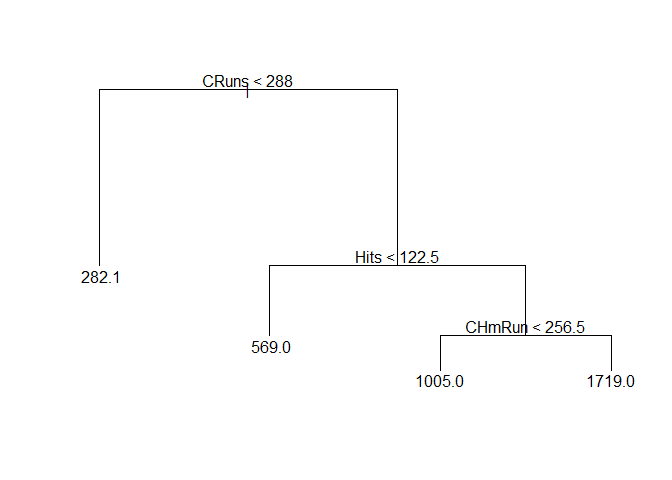<!-- -->

We can see that the most important variables used as criterion to spilt
the tree are: CRuns, Hits, CHmRun.

Let’s see how it perform on the test data:

``` r
set.seed(42)
pre_Tree1<- predict(Tree1, test_x)
pre_Pruned_Tree1 <-  predict(pruned_Tree1, test_x)
MSE_Tree<- mean((test_y - pre_Tree1)^2)
MSE_Pruned_Tree<- mean((test_y - pre_Pruned_Tree1)^2)
print(paste("MSE full tree: ", MSE_Tree))
```

    ## [1] "MSE full tree:  75757.5419478215"

``` r
print(paste("MSE Pruned tree: ", MSE_Pruned_Tree))
```

    ## [1] "MSE Pruned tree:  79782.7325250855"

Since the MSE of the full tree is a few slower could be that we have low
variance inside our dataset.

> ### 3. Apply bagging on the training portion of the data and evaluate the test MSE. Does bagging improve the performance?

To do so we basically perform an operation with the randomForest
package. To perform the bagging operation we set the number of allowed
parameter for tree equal to the all parameter. We can perform this
operation of bagging directly using that package as:

``` r
set.seed(42)
library(randomForest)
Tree1_bag <- randomForest(Salary ~ ., data=train, mtry=length(train)-1, ntree=200)
pred <- predict(Tree1_bag, test_x)
MSE_bagged <- mean((test_y-pred)^2)
print(MSE_bagged)
```

    ## [1] 48477.79

The performance is definitely better.

> ### 4. When we grow a random forest, we have to choose the number m of variables to consider at each split. Set the range for m from 1 to nvar. Define a matrix with nvar rows and 2 columns and fill it with the test error and OOB error on training data corresponding to each choice of m. Save the matrix as a dataframe and give it suitable column names. Compare OOB errors with test errors across the m values. Are the values different? Do they reach the minimum for the same value of m?

So we will fit 19 different random forest each one having a different
number of parameter that correspond to the ‘m’ number of variable to
taking in count when perform the random split of them. Basically our
algorithm at each step, will subset randomly the features and pick m
random feature from them to build the tree.

So now we are collecting for each possible number of m from 1 to the
total number of features in the data set the training error and the test
error. We will use the default number of tree for a randomForest which
is 500.

``` r
set.seed(42)
oob_e <- c()
training_e <- c()
test_e <- c()
for (i in 1:length(test_x)){
  forest <- randomForest(Salary~., data=train, ntree=500, mtry=i)
  oob_e <- append(oob_e,forest$mse[500]) # not sure 
  pred<- predict(forest, test_x)
  MSE <- mean((pred-test_y)^2)
  test_e <- append(test_e, MSE)
  pred_t <- predict(forest, train)
  MSE_t <- mean((pred_t-train_y)^2)
  training_e <- append(training_e, MSE_t)
}
```

Now we plot the test error and the training error over all the possible
m, from 1 to m.

``` r
check_perfomance <- data.frame(M = 1:length(test_x), 
                               Test_e=test_e, Training_e=training_e,
                               OOB_e =oob_e )
ggplot(data=check_perfomance, aes(x=M))+
  geom_line(data=check_perfomance, aes(y=Test_e, colour="Test Error"))+
  geom_point(data=check_perfomance, aes(y=Test_e), colour="red")+
  geom_line(data=check_perfomance, aes(y=Training_e, colour="Training Error"))+
  geom_point(data=check_perfomance, aes(y=Training_e), colour="blue")+
  geom_line(data=check_perfomance, aes(y=OOB_e, colour="OOB Error"))+
  geom_point(data=check_perfomance, aes(y=OOB_e), colour="gold")+
  scale_colour_manual("", values=c("gold2","red","blue"))+theme_tufte()+
  labs(title = 'Training, OOB and error rate ~ M')+
  ylab("Training and Error rate")+
  theme(legend.position = "top")
```

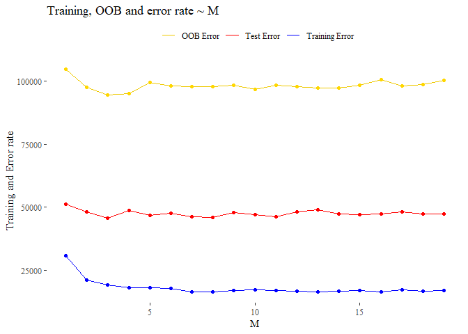<!-- -->

Hard to define the good choice of M. We see that reached m=5 the test
error is quiet regular while the training error also remains almost
fixed. i think that we can choice an M around 7 which is what is
recommend when we are dealing regression contest (p/3).

> ### 5. Reach a conclusion about the optimal random forest model on the training data and evaluate the model performance on the test data. Identify the variables that are important for prediction

Since we decide to use the model with a M=7 we test this again this
model on the test data and we also try to understand what are the most
important variables. this last operation is made thanks to an argument
inserted into the randomForest function that allows to keep track of the
importance of the all features.

``` r
set.seed(42)
forest <- randomForest(Salary~., data=train, ntree=500, mtry=7, importance=T)
MSE_BEST <- mean((predict(forest,test_x)-test_y)^2)
print(paste("The MSE over the Test set using m=7 is:", MSE_BEST))
```

    ## [1] "The MSE over the Test set using m=7 is: 46856.3369010197"

While the important features used from the forest are:

``` r
x<- data.frame(forest$importance)
tmp<- x[order(x$IncNodePurity, decreasing = T),]
pander((tmp), caption="Forest with M=7")
```

|               | X.IncMSE | IncNodePurity |
|:-------------:|:--------:|:-------------:|
|   **CHits**   |  39019   |    4641070    |
|   **CRBI**    |  26186   |    4575800    |
|   **CRuns**   |  36984   |    4559366    |
|   **Hits**    |  10860   |    3196894    |
|  **CAtBat**   |  25101   |    3140547    |
|  **CWalks**   |  22004   |    2930865    |
|   **Walks**   |   4426   |    2552785    |
|    **RBI**    |   6848   |    2516381    |
|   **Runs**    |   8137   |    2357556    |
|  **CHmRun**   |  11971   |    2340936    |
|  **PutOuts**  |   4642   |    2011789    |
|   **AtBat**   |  12102   |    1979790    |
|   **HmRun**   |   3341   |    907940     |
|   **Years**   |  11051   |    887128     |
|  **Assists**  |  -949.5  |    585313     |
|  **Errors**   |  -340.1  |    500344     |
|  **League**   |  -903.7  |    101676     |
| **NewLeague** |  60.78   |     89925     |
| **Division**  |  -43.81  |     48158     |

Forest with M=7

We are interested in second column which represent the total decrease in
node impurity thanks to that variable (higher is better). we can see
that the 5 more importants are CRBI, CRuns, CHits, Hits, Cwalks.

``` r
library(dplyr)
important_feature_plot <- as.data.frame(varImpPlot(forest))
```

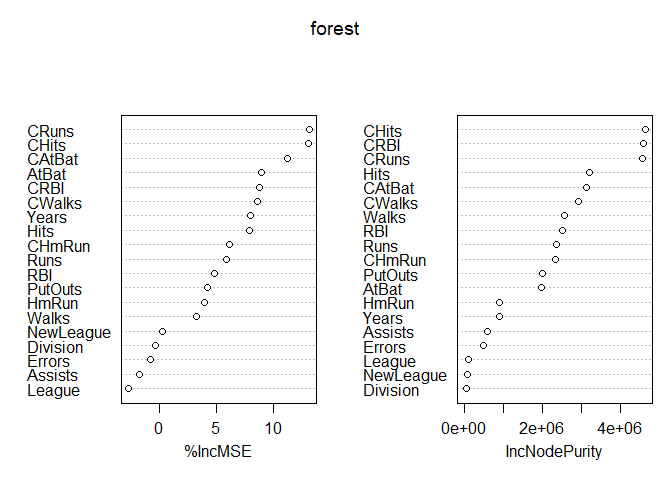<!-- -->

``` r
important_feature_plot$varnames <- rownames(important_feature_plot)
important_feature_plot$var_categ <- rep(1:19) 
```

``` r
ggplot(important_feature_plot, aes(x=reorder(varnames, IncNodePurity), 
                                   y=IncNodePurity, color=as.factor(var_categ))) + 
  geom_point(size=2) +
  geom_segment(aes(x=varnames,xend=varnames,y=0,yend=IncNodePurity), lwd=1) +
  scale_color_discrete(name="Variable Group") +
  ylab("IncNodePurity") + xlab("")+coord_flip() + 
  theme_tufte()+ theme(legend.position = "None")+ 
  ggtitle("Importance in terms of NodePurity\n")
```

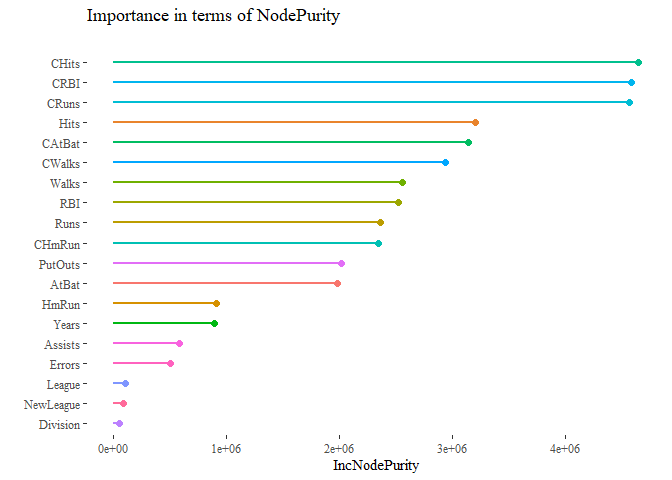<!-- -->

> ### 6. Fit a regression tree on the training data using boosting. Find the optimal number of boosting iterations, both by evaluating the OOB error and the cross-validation error. Produce plots with OOB error and CV error against the number of iterations: are the two methods leading to the same choice of the optimal number of iterations? Reach a conclusion about the optimal model, evaluate the test MSE of this model and produce a partial dependence plot of the resulting top N variables (N of your choice).

``` r
library(gbm)
set.seed(42)
forest_boosted <- gbm(Salary ~ ., data=train, distribution="gaussian",
n.trees=5000, interaction.depth=4)
```

Since we are working in the regression context we must specify the
distribution equal to ‘gaussian’, the other important argument is
interaction.depth. Basically the boosted algorithm create a very large
of tree but with a imitated number of terminal nodes, that
interaction.depth represent exactly the maximum number of nodes allowed.

``` r
x<- summary(forest_boosted)
```

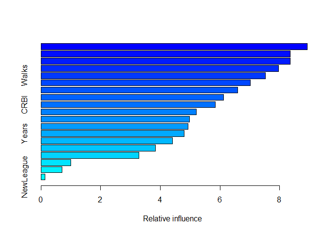<!-- -->

bag.fraction from documentation: the fraction of the training set
observations randomly selected to propose the next tree in the
expansion. This introduces randomnesses into the model fit. If
bag.fraction \< 1 then running the same model twice will result in
similar but different fits. gbm uses the R random number generator so
set.seed can ensure that the model can be reconstructed.

``` r
set.seed(42)
training_error <- c()
outofbagerror <- c()
cverror <- c()
noftrees <- 500 # since it is very slow, so it easy to modify it.
for (i in 1:20){
  bosted_tmp <- gbm(Salary ~ ., data=data, distribution="gaussian",
               n.trees=noftrees, interaction.depth=i ,cv.folds = 10)
  # not sure OOB:
  r = sample(nrow(data),nrow(data)*0.5)
  pred_oob <- predict(bosted_tmp, data[-r,])
  out_e <- mean((pred_oob-data$Salary[-r])^2)
  outofbagerror <- append(outofbagerror, out_e)

  training_error <- append(training_error, mean(bosted_tmp$train.error))
  cverror <- append(cverror, mean(bosted_tmp$cv.error))
}
```

Let’s see the results of our analysis:

``` r
gbm::gbm.perf(bosted_tmp, method="OOB")
```

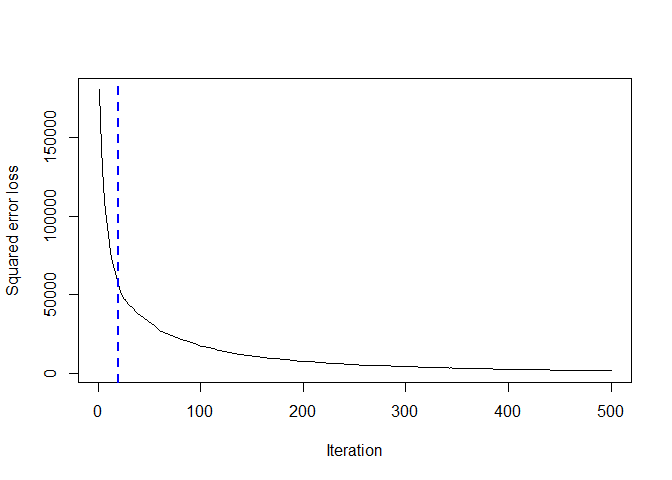<!-- -->

    ## [1] 20
    ## attr(,"smoother")
    ## Call:
    ## loess(formula = object$oobag.improve ~ x, enp.target = min(max(4, 
    ##     length(x)/10), 50))
    ## 
    ## Number of Observations: 500 
    ## Equivalent Number of Parameters: 39.85 
    ## Residual Standard Error: 325.4

``` r
tmpdf <- data.frame(Iteration=1:20,OOB_error=outofbagerror, CV_error=cverror, 
                    Train_error=training_error)
pander(tmpdf)
```

| Iteration | OOB_error | CV_error | Train_error |
|:---------:|:---------:|:--------:|:-----------:|
|     1     |   55385   |  92847   |    50153    |
|     2     |   36137   |  86799   |    31175    |
|     3     |   45038   |  88257   |    22266    |
|     4     |   54888   |  95575   |    18127    |
|     5     |   34856   |  87375   |    16602    |
|     6     |   21598   |  84029   |    16318    |
|     7     |   50589   |  92686   |    14233    |
|     8     |   22686   |  88158   |    14727    |
|     9     |   32194   |  84644   |    14727    |
|    10     |   20348   |  101439  |    13852    |
|    11     |   21316   |  88437   |    15200    |
|    12     |   36377   |  90824   |    14732    |
|    13     |   23258   |  92980   |    14679    |
|    14     |   32189   |  92937   |    14049    |
|    15     |   27228   |  89708   |    14988    |
|    16     |   31590   |  91493   |    14077    |
|    17     |   16919   |  89900   |    14205    |
|    18     |   39235   |  90232   |    15248    |
|    19     |   19244   |  94167   |    15172    |
|    20     |   23728   |  85323   |    13348    |

To have a better understanding we can also plot it as well.

``` r
title_1 <- "Trainig, Cross-validation & Out Of Bag error ~ Number of terminal nodes"
ggplot(data=tmpdf, aes(x=Iteration))+
  geom_line(data=tmpdf, aes(y=OOB_error, colour="OOB Error"))+
  geom_point(data=tmpdf, aes(y=OOB_error, colour="OOB Error"))+
  geom_line(data=tmpdf, aes(y=Train_error, colour="Train_error"))+
  geom_point(data=tmpdf, aes(y=Train_error, colour="Train_error"))+
  geom_line(data=tmpdf, aes(y=CV_error, colour="CV error"))+ 
  geom_point(data=tmpdf, aes(y=CV_error, colour="CV error"))+
  scale_colour_manual("", values=c("red","blue","gold2"))+theme_tufte()+
  theme(legend.position = "top")+labs(title=title_1,
                                      caption=paste("Number of tree =",noftrees))
```

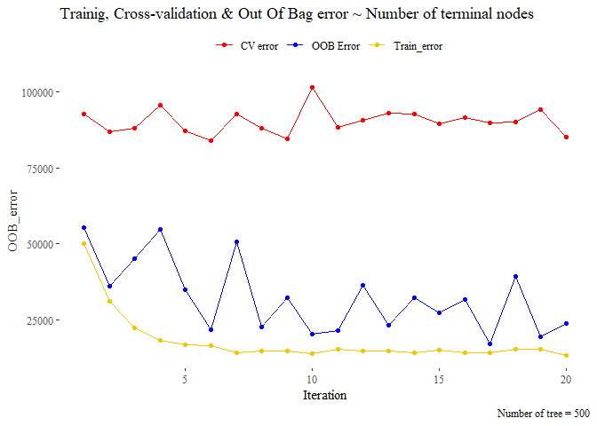<!-- --> The methods seems
that leads a different choice of the number of iteration. the cross
validation set seem very irregular and seems that it does not converge
in any case while the OOB seems that start converge around 11 iteration.
So we pick 10 as optimal number of iteration.

``` r
Optimized <- gbm(Salary ~ ., data=train, distribution="gaussian",
               n.trees=noftrees, interaction.depth=11 ,cv.folds = 10)

pred_Op <- predict(Optimized, test_x)
```

    ## Using 93 trees...

``` r
mse_boost <- mean((pred_Op-test_y)^2)
```

``` r
print(paste("MSE of optimized boosted forest:" ,mse_boost))
```

    ## [1] "MSE of optimized boosted forest: 59354.0488668846"

Let’s plot the partial depend plot, trough that we are able to see how
much the variable affect the entire forest! so we are looking how much
important are the variable in question. we pick an arbitrary number of 4
variables:

``` r
most_important_f<- c("CRBI","Hits","CHits","CHits")
plots1 <- plot(Optimized, i=most_important_f[1], main=most_important_f[1])
plots2 <- plot(Optimized, i=most_important_f[2], main=most_important_f[2])
plots3 <- plot(Optimized, i=most_important_f[3], main=most_important_f[3])
plots4 <- plot(Optimized, i=most_important_f[4], main=most_important_f[4])
grid.arrange(plots1,plots2,plots3,plots4)
```

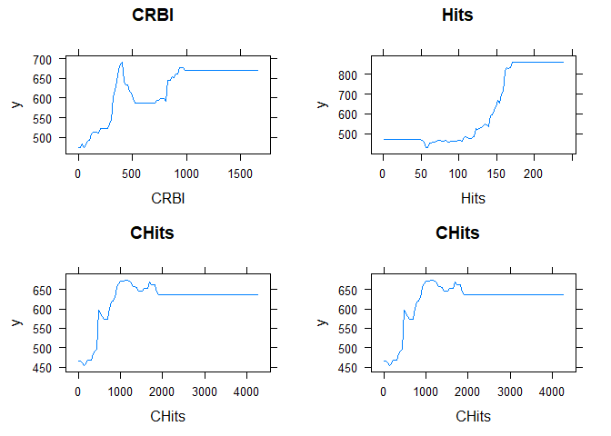<!-- -->

> #### 7. Draw some general conclusions about the analysis and the different methods that you considered

We saw different approach to the problems, now we can say something
about the models and which one could be the best. Basically the single
tree is a weak option, it cannot reach optimal level of accuracy while
using randomForest yes. Moreover if we can combine gradient boost
algorithm to randomForest the result will generally improve. Since with
those methods the risk of overfitting is quiet large we can also keep in
mind to eventually prune the trees or even better when performing
boosting operation try to keep the number of iteration slow so to let
the complexity of each tree small. To see which one perfomed better in
our dataframe we can compare the MSE!

``` r
final <- data.frame(MSE=c(MSE_Tree,MSE_Pruned_Tree,MSE_bagged,MSE_BEST,mse_boost), 
                    Model=c('Full tree','Pruned tree','Bagged tree', 
                            'RandomForest','RandomForest boosted'))
pander(final)
```

|  MSE  |        Model         |
|:-----:|:--------------------:|
| 75758 |      Full tree       |
| 79783 |     Pruned tree      |
| 48478 |     Bagged tree      |
| 46856 |     RandomForest     |
| 59354 | RandomForest boosted |

``` r
final <- final[order(final["MSE"]),]
ggplot(data=final, aes(y=MSE, x=reorder(Model, -MSE), fill=Model))+
  geom_bar(stat='identity')+ theme_tufte()+
  theme(legend.position="bottom",legend.title=element_blank())+
  ggtitle("MSE of the differents model")+ xlab("")
```

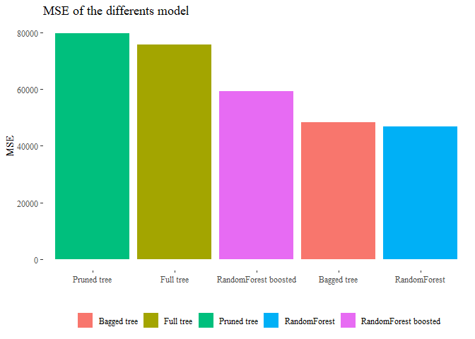<!-- -->
