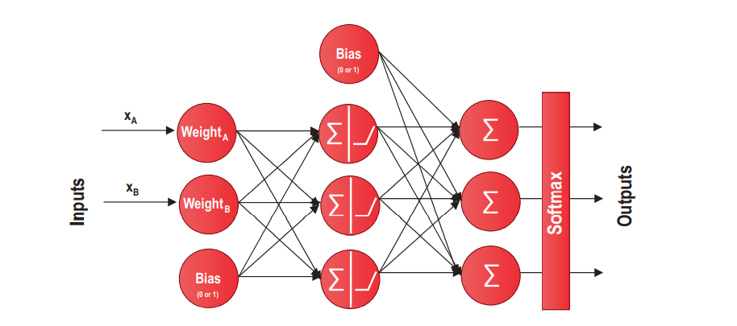

# Overview Neural Network

## Structure of Artificial Neural Networks

The deep neural networks we come across today are improved versions of multilayer perceptrons (MLP). We often use a more complex activation function than a step function (0 or 1) such as ReLU, Sigmoid, Tanh, and  Softmax.

## Activation Functions

An activation function is usually added to the end of each neuron, which affects what to fire to the next neuron. In other words the **activation function of a neuron gives the output of that neuron after being given an input or set of inputs**. *Tanh, ReLU, and Sigmoid* activation functions are widely used for single neuron activation.

1. **ReLU** function is a widely used general-purpose activation function. It should be used in hidden layers. In case there are dead neurons, Leaky ReLU may fix potential problems.

2. The **Sigmoid** function works best in classification tasks but it may cause vanishing gradient problem with **Tanh**.

The best strategy for an optimized training practice is to start with ReLU and try the other activation functions to see if the performance improves.

Activation functions increase the capabilities of the neural networks to use relevant information and suppress the irrelevant data points. Without activation functions, our neural networks would only be performing a linear transformation. 

## Loss functions

Loss functions are functions that are used to measure the performance of a deep learning model for given data. It is usually based on error terms, which is calculated as the *distance between the real (measured) value and the prediction of the trained model*. typically  Root Mean Squared Error (**RMSE**) function is the right loss function for regression problems in which we would like to penalize large errors, multi-class **crossentropy** should be selected for multi-class classification problems.

## Optimization in Deep Learning

Optimization functions **make small changes to the weights and biases and measure the effects of these changes with loss functions**. This process helps to find the optimal weight and bias values to minimize errors and maximize the accuracy of the model. The **backpropagation** algorithm is an essential component in neural network architecture used for iteration in parallel with optimizer. It serves as a central mechanism by which neural networks learn. The name explains itself since the word propagate means to transmit something. Therefore, the word  backpropagation means “transmitting information back.” This is what the backpropagation algorithm precisely does: it takes the calculated loss back to the system, which is used by the optimizer to adjust the weights and biases. 

1. The NN makes a prediction with the current weights and biases
2. The performance of the NN is measured with a loss function
3. this error measure is backprogpagted to optimizer to that it can readjust the weights and biases

By using the information provided by the backpropagation algorithm, **optimization algorithms can perfect the weights and biases used in the neural network**. The most common optimization algorithms used in deep learning tasks are listed as follows:

- *Adam*
- *Stochastic gradient descent (SGD)* (mini-batch gradient descent uses a small batch so that training may still be fast as well as reliable)

## Overfitting and Regularization

Overfitting is also a challenge in deep learning. We don’t want our neural network to fit a limited set of data points too tightly, which jeopardizes its performance in the real world. We also don’t want our model to underfit since it would not give us a good accuracy level. 

Regularization is a technique to fight overfitting. There are a number of possible methods used for regularization, which may be listed as follows:

- **Early stopping** (Early stopping is a very simple – yet effective – strategy to prevent overfitting. Setting a sufficient number of epochs (training steps) is crucial to achieving a good level of accuracy.)

- **Dropout** With dropout enabled, our model temporarily removes some of the neurons or layers from the network, which adds additional noise to the neural network. This noise prevents the model from fitting to the training 
data too closely and makes the model more flexible
 
- **L1 and L2 regularization** These two methods add an additional penalty term to the loss function (Lasso and Ridge).

- **Data augmentation** Data augmentation is a method to increase the amount of training data. By making small transformations on the existing data, we can generate more observations and add them to the original dataset.

## Feature Scaling

Another crucial concept in deep learning is feature scaling. F**eature scaling is a method to normalize the range of features so that neural networks perform more accurately**. 

There are several feature scaling methods which are listed as follows:
- **Standardization**: It adjusts the values of each feature to have zero mean and unit variance.
- **Min-Max Normalization** (Rescaling): It scales the values of each feature between [0, 1] and [-1, 1].
- **Mean Normalization**: It deducts the mean from each data point and divides the result to max-min differential. It is a slightly altered and less popular version of min-max normalization.
- **Scaling to Unit Length**: It divides each component of a feature by the Euclidian length of the vector of this feature

# FeedForward Neural Networks

Feedforward neural networks are a group of artificial neural networks in which the connections between neurons 
do not form a cycle. Connections between neurons are unidirectional and move in only forward direction from input layer through hidden layers and to output later. In other words, the reason these networks are called feedforward is that the flow of information takes place in the forward direction.

Feedforward neural networks are mainly used for supervised learning tasks.**They are especially useful in analytical applications and quantitative studies** where traditional machine learning algorithms are also used. Since deep feedforward neural networks can approximate any linear or nonlinear function, they are widely used in real-world pplications, both for classification and regression problems.

## Layers
Our generic feedforward neural network architecture consists of three types of layers:
- An input layer
- An output layer
- A number of hidden layers

Input layer is the very first layer of feedforward neural network, which is used to feed data into the network. Input layer does not utilize an activation function and its sole purpose to get the data into the system. *The number of neurons in an input layer must be equal to the number of features* (i.e., explanatory variables) fed into the system. For nstance, if we are using five different explanatory variables to predict one response variable, our model’s input layer must have five neurons.

Output layer is the very last layer of the feedforward neural network, which is used to output the prediction. The number of neurons in the output layer is decided based on the nature of the problem.

Hidden layers are created to ensure the approximation of the nonlinear functions. We can add as many hidden layers as we desire, and the number of neurons at each layer can be changed.